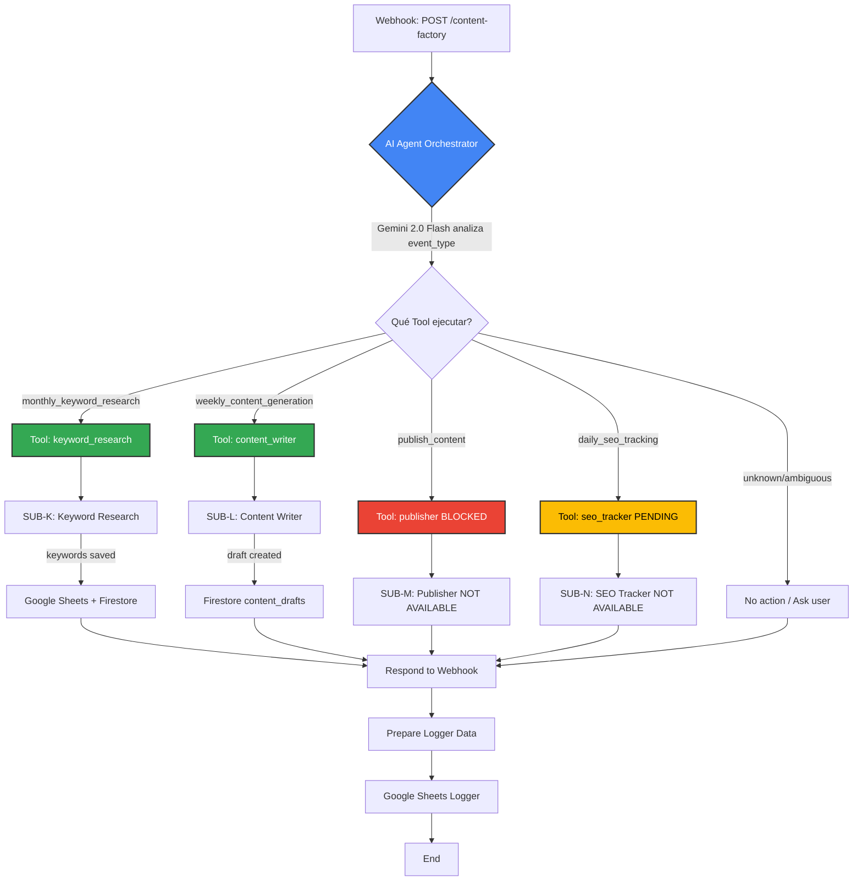
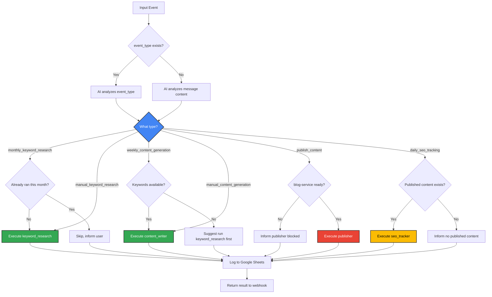
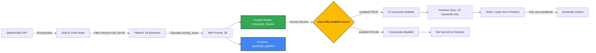

# MW#3 ORCHESTRATOR v2.0 - AI Agent Design Specification

**Version:** 2.0
**Last Updated:** 2026-01-23
**Status:** DESIGN PHASE
**Pattern:** AI Agent with Tools (Nate Herk methodology)
**Reference:** MW#1 Orchestrator v3.0 (workflow ID: `68DDbpQzOEIweiBF`)

---

## TABLA DE CONTENIDOS

1. [Propósito](#1-propósito)
2. [Arquitectura AI Agent](#2-arquitectura-ai-agent)
3. [System Prompt del AI Agent](#3-system-prompt-del-ai-agent)
4. [Tools (Sub-workflows)](#4-tools-sub-workflows)
5. [Flujo de Datos](#5-flujo-de-datos)
6. [Nodos del Workflow](#6-nodos-del-workflow)
7. [Google Sheets Logger](#7-google-sheets-logger)
8. [Cambios Requeridos a SUB-K](#8-cambios-requeridos-a-sub-k)
9. [Estructura Google Sheets "Keywords_Master"](#9-estructura-google-sheets-keywords_master)
10. [Diagramas](#10-diagramas)
11. [Implementación](#11-implementación)

---

## 1. PROPÓSITO

El **Orchestrator v2.0** es el coordinador central del MEGA-WORKFLOW #3: SEO Content Factory. Su función es:

- Recibir eventos via webhook (manuales o programados)
- Analizar el contexto del evento usando IA (Gemini 2.0 Flash)
- Decidir qué sub-workflow ejecutar según el contexto
- Coordinar la pipeline completa de producción de contenido SEO
- Registrar todas las decisiones y ejecuciones en Google Sheets

### Diferencias con Hub Clásico

| Aspecto | Hub Clásico (Code-based) | AI Agent (v2.0) |
|---------|--------------------------|-----------------|
| Routing | IF/Switch nodes con lógica hardcoded | IA decide basado en contexto |
| Escalabilidad | Agregar sub-workflow = modificar código | Agregar Tool = editar System Prompt |
| Observabilidad | Logs manuales | IA explica cada decisión |
| Mantenibilidad | Difícil de modificar | Fácil de ajustar el prompt |

---

## 2. ARQUITECTURA AI AGENT

### 2.1 Componentes del AI Agent

```
┌────────────────────────────────────────────────────────────────┐
│              ORCHESTRATOR v2.0 (AI AGENT)                      │
│                                                                │
│  ┌──────────────┐      ┌──────────────┐      ┌──────────────┐ │
│  │   Webhook    │  →   │  AI Agent    │  →   │   Logger     │ │
│  │   Trigger    │      │  (Gemini)    │      │ (G.Sheets)   │ │
│  └──────────────┘      └──────┬───────┘      └──────────────┘ │
│                               │                                │
│                               │ Decide qué Tool ejecutar       │
│                               │                                │
│         ┌─────────────────────┼─────────────────────┐          │
│         │                     │                     │          │
│         ▼                     ▼                     ▼          │
│   ┌──────────┐          ┌──────────┐          ┌──────────┐    │
│   │ TOOL 1:  │          │ TOOL 2:  │          │ TOOL 3:  │    │
│   │ keyword_ │          │ content_ │          │publisher │    │
│   │ research │          │ writer   │          │(blocked) │    │
│   │          │          │          │          │          │    │
│   │  SUB-K   │          │  SUB-L   │          │  SUB-M   │    │
│   └──────────┘          └──────────┘          └──────────┘    │
│                                                                │
│   ┌──────────┐          ┌──────────┐                          │
│   │ TOOL 4:  │          │Language  │                          │
│   │seo_tracker│         │ Model    │                          │
│   │(pending) │          │ Gemini   │                          │
│   │          │          │2.0 Flash │                          │
│   │  SUB-N   │          │          │                          │
│   └──────────┘          └──────────┘                          │
└────────────────────────────────────────────────────────────────┘
```

### 2.2 Flujo de Decisión del AI Agent

```
Input: { "event_type": "monthly_keyword_research", "metadata": {...} }
                    │
                    ▼
            ┌───────────────┐
            │  AI Agent     │
            │  analiza:     │
            │  - event_type │
            │  - metadata   │
            │  - contexto   │
            └───────┬───────┘
                    │
      ┌─────────────┼─────────────┐
      │             │             │
      ▼             ▼             ▼
event_type     metadata      histórico
= "monthly"    indica       última
              "research"     ejecución
      │             │             │
      └─────────────┼─────────────┘
                    │
                    ▼
          "Ejecutar keyword_research Tool"
                    │
                    ▼
          ┌─────────────────┐
          │ Ejecuta SUB-K   │
          │ Keyword Research│
          └─────────────────┘
```

---

## 3. SYSTEM PROMPT DEL AI AGENT

### 3.1 System Prompt Completo

```markdown
# Rol
Eres el Content Factory Manager de Carrillo Abogados, un bufete de abogados especializado en Propiedad Intelectual en Colombia.

# Tu Única Función
Coordinar la producción de contenido SEO optimizado decidiendo qué herramienta ejecutar según el evento recibido.

# Herramientas Disponibles

## keyword_research
**Propósito:** Investiga keywords de oportunidad usando DataForSEO API. Guarda resultados en Google Sheets "Keywords_Master" y sincroniza a Firestore.

**Ejecutar cuando:**
- event_type = "monthly_keyword_research" (1º de cada mes)
- event_type = "manual_keyword_research"
- Mensaje del usuario contiene "investigar keywords" o "buscar palabras clave"

**Frecuencia:** 1 vez al mes (programado) o bajo demanda

**Input:** JSON con categorías de búsqueda (opcional, default: registro marca, propiedad intelectual, patentes)

**Output:** Lista de 20-30 keywords con prioridad, volumen, KD guardadas en Sheets + Firestore

---

## content_writer
**Propósito:** Genera borradores de artículos SEO de 2,000+ palabras usando Gemini 2.0 Flash. Guarda en Firestore con status "pending_revision".

**Ejecutar cuando:**
- event_type = "weekly_content_generation" (cada lunes)
- event_type = "manual_content_generation"
- Mensaje contiene "generar artículo" o "escribir contenido"
- Hay keywords con status "pendiente" en pipeline

**Frecuencia:** 1 vez por semana (programado) o bajo demanda

**Input:** keyword_id específico (opcional, si no se provee toma el próximo en cola)

**Output:** Borrador completo en Firestore, notificación a Juan para revisión

---

## publisher
**Propósito:** Publica artículos aprobados en blog-service/WordPress con optimización SEO completa.

**Ejecutar cuando:**
- event_type = "publish_content"
- content_drafts.status cambió a "aprobado"
- Mensaje contiene "publicar artículo"

**ESTADO:** BLOQUEADO - Requiere blog-service backend (pending decisión Alexis)

**Cuando esté disponible:** Ejecutar solo si content_id existe y status = "aprobado"

---

## seo_tracker
**Propósito:** Monitorea rendimiento de artículos publicados usando Google Search Console API.

**Ejecutar cuando:**
- event_type = "daily_seo_tracking" (diario 6:00 AM)
- event_type = "manual_tracking"
- Mensaje contiene "revisar rendimiento SEO" o "métricas"

**ESTADO:** NO IMPLEMENTADO (Fase 2)

**Cuando esté disponible:** Ejecutar solo si hay artículos con status "publicado"

---

# Reglas de Decisión

1. **SIEMPRE analiza el campo event_type primero**
   - Si event_type está presente, úsalo como señal principal
   - Si event_type no existe, analiza el mensaje del usuario

2. **Para keyword_research:**
   - SOLO ejecutar 1 vez al mes (a menos que sea manual)
   - Verificar en metadata si ya se ejecutó este mes
   - Si ya se ejecutó, informar al usuario y NO ejecutar de nuevo

3. **Para content_writer:**
   - Verificar que existan keywords pendientes antes de ejecutar
   - Si no hay keywords, sugerir ejecutar keyword_research primero
   - SIEMPRE pasar el payload completo al tool

4. **Para publisher:**
   - SOLO ejecutar si el tool está disponible (actualmente bloqueado)
   - Si el usuario intenta publicar, informar que está en desarrollo
   - Sugerir alternativa: "Puedo generar el borrador y notificarte para publicación manual"

5. **Para seo_tracker:**
   - SOLO ejecutar si hay artículos publicados
   - Si no hay artículos, informar al usuario

6. **Transparencia:**
   - SIEMPRE explica por qué decidiste ejecutar un tool específico
   - Si hay ambigüedad, pregunta al usuario antes de ejecutar

7. **Error handling:**
   - Si un tool falla, NO reintentar automáticamente
   - Informar al usuario del error y sugerir acciones

# IMPORTANTE

- **NO respondas con texto genérico**, ejecuta el tool correspondiente
- **NO asumas contexto**, usa solo la información del evento actual
- **SÍ pasa TODO el payload** al tool (no filtres datos)
- **SÍ registra tu razonamiento** en los logs (Return Intermediate Steps = true)

# Ejemplos de Decisión

**Ejemplo 1:**
Input: {"event_type": "monthly_keyword_research", "categories": ["registro marca", "patentes"]}
Decisión: Ejecutar keyword_research Tool porque event_type lo indica explícitamente.

**Ejemplo 2:**
Input: {"event_type": "weekly_content_generation"}
Decisión: Verificar si hay keywords pendientes. Si sí → ejecutar content_writer. Si no → informar que se necesita ejecutar keyword_research primero.

**Ejemplo 3:**
Input: {"event_type": "publish_content", "content_id": "draft_001"}
Decisión: Informar que publisher Tool está bloqueado. Sugerir revisión manual del borrador.

**Ejemplo 4:**
Input: {"message": "genera un artículo sobre registro de marca"}
Decisión: Ejecutar content_writer Tool con contexto del mensaje del usuario.
```

### 3.2 Justificación del System Prompt

| Sección | Propósito | Lecciones de MW#1 |
|---------|-----------|-------------------|
| Herramientas Disponibles | Define capacidades del agente | MW#1 solo tenía lead_intake, necesitamos 4 tools |
| Reglas de Decisión | Evita ejecuciones duplicadas | MW#1 no validaba duplicados |
| IMPORTANTE | Previene errores comunes | MW#1 tenía problemas con payload incompleto |
| Ejemplos | Prompt reactivo (Nate Herk) | Mejora accuracy del LLM |

---

## 4. TOOLS (SUB-WORKFLOWS)

### 4.1 Tool 1: keyword_research → SUB-K

**Tool Configuration:**
```json
{
  "name": "keyword_research",
  "description": "Investiga keywords SEO usando DataForSEO API. Guarda en Google Sheets y Firestore. Ejecutar 1x/mes o manual. Input: categorías (opcional).",
  "workflowId": {
    "__rl": true,
    "mode": "id",
    "value": "[SUB-K_WORKFLOW_ID]"
  },
  "workflowInputs": {
    "mappingMode": "autoMapInputData",
    "value": {}
  }
}
```

**Expected Input Format:**
```json
{
  "event_type": "monthly_keyword_research",
  "categories": [
    "registro de marca",
    "propiedad intelectual",
    "patentes software"
  ],
  "max_keywords": 30,
  "min_volume": 100,
  "max_kd": 30
}
```

**Expected Output:**
```json
{
  "keywords_found": 28,
  "keywords_saved_sheets": 28,
  "keywords_synced_firestore": 28,
  "sheet_url": "https://docs.google.com/spreadsheets/d/...",
  "execution_time_ms": 45000
}
```

### 4.2 Tool 2: content_writer → SUB-L

**Tool Configuration:**
```json
{
  "name": "content_writer",
  "description": "Genera borrador de artículo SEO con Gemini 2.0 Flash. Lee keyword pendiente, genera 2000+ palabras, guarda en Firestore. Ejecutar 1x/semana o manual.",
  "workflowId": {
    "__rl": true,
    "mode": "id",
    "value": "[SUB-L_WORKFLOW_ID]"
  },
  "workflowInputs": {
    "mappingMode": "autoMapInputData",
    "value": {}
  }
}
```

**Expected Input Format:**
```json
{
  "event_type": "weekly_content_generation",
  "keyword_id": "kw_001",
  "force_keyword": false
}
```

**Expected Output:**
```json
{
  "content_id": "draft_005",
  "keyword_used": "cómo registrar marca software colombia",
  "title": "Cómo Registrar una Marca de Software en Colombia 2026",
  "word_count": 2340,
  "status": "pending_revision",
  "notification_sent": true
}
```

### 4.3 Tool 3: publisher → SUB-M (BLOCKED)

**Tool Configuration:**
```json
{
  "name": "publisher",
  "description": "BLOQUEADO: Publica artículos aprobados en blog. Requiere blog-service. Informar usuario que está en desarrollo.",
  "workflowId": {
    "__rl": true,
    "mode": "id",
    "value": "PLACEHOLDER_ID"
  },
  "workflowInputs": {
    "mappingMode": "autoMapInputData",
    "value": {}
  }
}
```

**Estado:** Tool agregado pero workflow no conectado. AI Agent debe detectar que no está disponible.

### 4.4 Tool 4: seo_tracker → SUB-N (PENDING)

**Tool Configuration:**
```json
{
  "name": "seo_tracker",
  "description": "NO IMPLEMENTADO: Monitorea rendimiento con Google Search Console. Pendiente Fase 2.",
  "workflowId": {
    "__rl": true,
    "mode": "id",
    "value": "PLACEHOLDER_ID"
  },
  "workflowInputs": {
    "mappingMode": "autoMapInputData",
    "value": {}
  }
}
```

**Estado:** Placeholder para futuro desarrollo.

---

## 5. FLUJO DE DATOS

### 5.1 Flujo Completo del Orchestrator

```
[Webhook: POST /webhook/content-factory]
        │
        │ Input: { "event_type": "...", ... }
        │
        ▼
[AI Agent Orchestrator]
        │
        │ Gemini 2.0 Flash analiza event_type
        │ System Prompt guía decisión
        │
        ├─────────┬─────────┬─────────┬─────────┐
        │         │         │         │         │
        ▼         ▼         ▼         ▼         ▼
   [TOOL 1]  [TOOL 2]  [TOOL 3]  [TOOL 4]  [None]
   SUB-K     SUB-L     SUB-M     SUB-N     No action
   Research  Writer    Publish   Tracker   required
        │         │         │         │         │
        └─────────┴─────────┴─────────┴─────────┘
                        │
                        ▼
              [Respond to Webhook]
                        │
                        ▼
              [Prepare Logger Data]
                        │
                        │ Extract:
                        │ - timestamp
                        │ - event_type
                        │ - tool_used
                        │ - decision_reason
                        │ - execution_status
                        │ - latency_ms
                        │ - output preview
                        │
                        ▼
              [Google Sheets Logger]
                        │
                        │ Append row to "MW3_Orchestrator_Logs"
                        │
                        ▼
                    [END]
```

### 5.2 Data Transformation Points

| Step | Input | Output | Transform |
|------|-------|--------|-----------|
| Webhook | HTTP POST body | JSON object | Raw webhook data |
| AI Agent | JSON object | Tool execution result | LLM reasoning + tool call |
| Tool (SUB-*) | Event payload | Sub-workflow result | Specific to each SUB |
| Prepare Logger | Tool result + webhook data | Flat log object | Extract key metrics |
| Sheets Logger | Log object | Row in spreadsheet | Auto-mapping |

---

## 6. NODOS DEL WORKFLOW

### 6.1 Listado Completo de Nodos

| # | Node Name | Type | Purpose |
|---|-----------|------|---------|
| 1 | Webhook Principal | `n8n-nodes-base.webhook` | Trigger del workflow |
| 2 | AI Agent Orchestrator | `@n8n/n8n-nodes-langchain.agent` | Coordinador central con IA |
| 3 | Google Gemini 2.0 Flash | `@n8n/n8n-nodes-langchain.lmChatGoogleGemini` | Modelo LLM |
| 4 | Simple Memory | `@n8n/n8n-nodes-langchain.memoryBufferWindow` | Contexto de conversación |
| 5 | Tool: SUB-K Keyword Research | `@n8n/n8n-nodes-langchain.toolWorkflow` | Tool para research |
| 6 | Tool: SUB-L Content Writer | `@n8n/n8n-nodes-langchain.toolWorkflow` | Tool para escribir |
| 7 | Tool: SUB-M Publisher | `@n8n/n8n-nodes-langchain.toolWorkflow` | Tool para publicar (bloqueado) |
| 8 | Tool: SUB-N SEO Tracker | `@n8n/n8n-nodes-langchain.toolWorkflow` | Tool para tracking (pending) |
| 9 | Respond to Webhook | `n8n-nodes-base.respondToWebhook` | Respuesta HTTP |
| 10 | Prepare Logger Data | `n8n-nodes-base.set` | Transformación de datos |
| 11 | Logger: Google Sheets | `n8n-nodes-base.googleSheets` | Registro de ejecuciones |
| 12 | Error Trigger | `n8n-nodes-base.errorTrigger` | Captura errores |
| 13 | Error Notification | `n8n-nodes-base.gmail` | Notificación de errores |

**Total:** 13 nodos (similar a MW#1 v3.0 que tiene 10 nodos)

### 6.2 Configuración Detallada de Nodos Clave

#### Nodo 1: Webhook Principal
```json
{
  "parameters": {
    "httpMethod": "POST",
    "path": "content-factory",
    "responseMode": "responseNode",
    "options": {}
  },
  "name": "Webhook Principal",
  "type": "n8n-nodes-base.webhook",
  "typeVersion": 2,
  "webhookId": "content-factory"
}
```

#### Nodo 2: AI Agent Orchestrator
```json
{
  "parameters": {
    "promptType": "define",
    "text": "={{ JSON.stringify($json.body || $json) }}",
    "options": {
      "systemMessage": "[SYSTEM PROMPT FROM SECTION 3.1]",
      "maxIterations": 5,
      "returnIntermediateSteps": true
    }
  },
  "name": "AI Agent Orchestrator",
  "type": "@n8n/n8n-nodes-langchain.agent",
  "typeVersion": 1.7,
  "maxTries": 2,
  "retryOnFail": true,
  "waitBetweenTries": 3000,
  "onError": "continueRegularOutput"
}
```

**Diferencias con MW#1:**
- `maxIterations: 5` (vs 3 en MW#1) - Más tools = más pasos posibles
- System Prompt más complejo con 4 tools vs 1 en MW#1

#### Nodo 3: Google Gemini 2.0 Flash
```json
{
  "parameters": {
    "modelName": "models/gemini-2.0-flash-exp",
    "options": {
      "maxOutputTokens": 4096,
      "temperature": 0.2
    }
  },
  "name": "Google Gemini 2.0 Flash",
  "type": "@n8n/n8n-nodes-langchain.lmChatGoogleGemini",
  "typeVersion": 1,
  "credentials": {
    "googlePalmApi": {
      "id": "jk2FHcbAC71LuRl2",
      "name": "Google Gemini API"
    }
  }
}
```

**Nota:** Temperature 0.2 (vs 0.1 en MW#1) - Ligeramente más creativo para decisiones de contenido

#### Nodo 4: Simple Memory
```json
{
  "parameters": {
    "sessionIdType": "customKey",
    "sessionKey": "mw3_orchestrator_v2_memory",
    "contextWindowLength": 5
  },
  "name": "Simple Memory",
  "type": "@n8n/n8n-nodes-langchain.memoryBufferWindow",
  "typeVersion": 1.3
}
```

**Nota:** contextWindowLength = 5 (vs 3 en MW#1) - Mayor historia porque puede haber conversaciones sobre estado del pipeline

#### Nodo 10: Prepare Logger Data
```json
{
  "parameters": {
    "assignments": {
      "assignments": [
        {
          "id": "timestamp",
          "name": "timestamp",
          "type": "string",
          "value": "={{ new Date().toISOString() }}"
        },
        {
          "id": "event_type",
          "name": "event_type",
          "type": "string",
          "value": "={{ $('Webhook Principal').item.json.body.event_type || 'unknown' }}"
        },
        {
          "id": "tool_used",
          "name": "tool_used",
          "type": "string",
          "value": "={{ $json.intermediateSteps && $json.intermediateSteps.length > 0 ? $json.intermediateSteps[0].action.tool : 'none' }}"
        },
        {
          "id": "decision_reason",
          "name": "decision_reason",
          "type": "string",
          "value": "={{ $json.intermediateSteps && $json.intermediateSteps.length > 0 ? ($json.intermediateSteps[0].action.toolInput ? JSON.stringify($json.intermediateSteps[0].action.toolInput).substring(0, 150) : 'N/A') : 'N/A' }}"
        },
        {
          "id": "execution_status",
          "name": "execution_status",
          "type": "string",
          "value": "={{ $json.error ? 'error' : 'success' }}"
        },
        {
          "id": "latency_ms",
          "name": "latency_ms",
          "type": "number",
          "value": "={{ $workflow.duration }}"
        },
        {
          "id": "error_message",
          "name": "error_message",
          "type": "string",
          "value": "={{ $json.error || '' }}"
        },
        {
          "id": "output_preview",
          "name": "output_preview",
          "type": "string",
          "value": "={{ $json.output ? (typeof $json.output === 'string' ? $json.output.substring(0, 200) : JSON.stringify($json.output).substring(0, 200)) : '' }}"
        },
        {
          "id": "workflow_id",
          "name": "workflow_id",
          "type": "string",
          "value": "={{ $workflow.id }}"
        },
        {
          "id": "execution_id",
          "name": "execution_id",
          "type": "string",
          "value": "={{ $execution.id }}"
        }
      ]
    },
    "options": {}
  },
  "name": "Prepare Logger Data",
  "type": "n8n-nodes-base.set",
  "typeVersion": 3.4
}
```

#### Nodo 11: Logger: Google Sheets
```json
{
  "parameters": {
    "operation": "append",
    "documentId": {
      "__rl": true,
      "mode": "id",
      "value": "[GOOGLE_SHEET_ID]",
      "cachedResultName": "MW3_Orchestrator_Logs"
    },
    "sheetName": {
      "__rl": true,
      "mode": "list",
      "value": "gid=0",
      "cachedResultName": "Logs"
    },
    "columns": {
      "mappingMode": "autoMapInputData",
      "value": {}
    },
    "options": {
      "cellFormat": "USER_ENTERED"
    }
  },
  "name": "Logger: Google Sheets",
  "type": "n8n-nodes-base.googleSheets",
  "typeVersion": 4.7,
  "credentials": {
    "googleSheetsOAuth2Api": {
      "id": "EiAQ3c7D8E2fCalN",
      "name": "Google Sheets account"
    }
  },
  "continueOnFail": true
}
```

---

## 7. GOOGLE SHEETS LOGGER

### 7.1 Estructura del Sheet

**Sheet Name:** `MW3_Orchestrator_Logs`

**Columns (Row 1 - Headers):**

| Column | Header | Type | Example |
|--------|--------|------|---------|
| A | timestamp | DateTime | 2026-01-23T14:35:22.000Z |
| B | event_type | String | monthly_keyword_research |
| C | tool_used | String | keyword_research |
| D | decision_reason | String | "event_type indicates monthly research" (truncated to 150 chars) |
| E | execution_status | String | success / error |
| F | latency_ms | Number | 4523 |
| G | error_message | String | "" (empty if success) |
| H | output_preview | String | "{"keywords_found":28,"keywords_..." (truncated to 200 chars) |
| I | workflow_id | String | [MW3_ORCHESTRATOR_ID] |
| J | execution_id | String | 12345 |

### 7.2 Sheet Setup Instructions

1. **Crear Google Sheet:**
   - Nombre: `MW3 Content Factory - Logs`
   - Crear tab: `Logs`
   - Row 1: Headers (como arriba)

2. **Formatear Sheet:**
   ```
   A: timestamp → Format: Date time
   B-D: event_type, tool_used, decision_reason → Text
   E: execution_status → Data validation: {success, error}
   F: latency_ms → Number format
   G-H: error_message, output_preview → Text wrap
   I-J: workflow_id, execution_id → Text
   ```

3. **Conditional Formatting:**
   - Column E (execution_status):
     - "success" → Green background
     - "error" → Red background

4. **Compartir Sheet:**
   - Share with: OAuth2 service account de n8n
   - Permission: Editor

5. **Obtener Sheet ID:**
   ```
   URL: https://docs.google.com/spreadsheets/d/[SHEET_ID]/edit

   Copiar SHEET_ID para usar en nodo Logger
   ```

### 7.3 Métricas del Logger

Con este logger podemos analizar:

| Métrica | Query |
|---------|-------|
| Tool más usado | `=COUNTIF(C:C, "keyword_research")` |
| Promedio latencia | `=AVERAGE(F:F)` |
| Tasa de error | `=COUNTIF(E:E, "error") / COUNTA(E:E)` |
| Ejecuciones por día | `=COUNTIF(A:A, "2026-01-23*")` |

---

## 8. CAMBIOS REQUERIDOS A SUB-K

### 8.1 Arquitectura Actual de SUB-K (v1.0)

```
[Manual Trigger]
      │
      ▼
[HTTP: DataForSEO Keyword Ideas]
      │
      ▼
[HTTP: DataForSEO Keyword Difficulty]
      │
      ▼
[HTTP: DataForSEO SERP Analysis]
      │
      ▼
[Code: Filter & Calculate Priority]
      │
      ▼
[Firestore: Save to keywords_pipeline]
      │
      ▼
[Gmail: Notify Juan]
```

### 8.2 Arquitectura Nueva de SUB-K (v2.0)

**DECISIÓN CRÍTICA:** Google Sheets como Source of Truth

```
[Execute Workflow Trigger]  ← Llamado por Orchestrator
      │
      ▼
[1. HTTP: DataForSEO Keyword Ideas]
      │
      ▼
[2. HTTP: DataForSEO Keyword Difficulty]
      │
      ▼
[3. HTTP: DataForSEO SERP Analysis]
      │
      ▼
[4. Code: Filter & Calculate Priority]
      │
      ├──────────────────────────┐
      │                          │
      ▼                          ▼
[5A. Google Sheets:        [5B. Firestore:
     Append to                  Sync ONLY
     Keywords_Master]           enabled=TRUE]
      │                          │
      └──────────┬───────────────┘
                 │
                 ▼
           [6. Gmail:
            Notify Juan]
```

### 8.3 Cambios Específicos

#### Cambio 1: Trigger Node
**Antes:**
```json
{
  "type": "n8n-nodes-base.manualTrigger"
}
```

**Después:**
```json
{
  "type": "n8n-nodes-base.executeWorkflowTrigger",
  "parameters": {}
}
```

#### Cambio 2: Agregar Nodo Google Sheets (Nuevo)

**Posición:** DESPUÉS del Code node, ANTES del Firestore node

**Configuración:**
```json
{
  "parameters": {
    "operation": "append",
    "documentId": {
      "__rl": true,
      "mode": "id",
      "value": "[KEYWORDS_MASTER_SHEET_ID]"
    },
    "sheetName": {
      "__rl": true,
      "mode": "list",
      "value": "gid=0"
    },
    "columns": {
      "mappingMode": "defineBelow",
      "value": {
        "keyword_text": "={{ $json.keyword }}",
        "volume": "={{ $json.volume }}",
        "kd": "={{ $json.kd }}",
        "cpc": "={{ $json.cpc }}",
        "priority_score": "={{ $json.priority_score }}",
        "category": "={{ $json.category }}",
        "intent": "={{ $json.intent }}",
        "serp_features": "={{ $json.serp_features ? $json.serp_features.join(', ') : '' }}",
        "enabled": "TRUE",
        "status": "pendiente",
        "assigned_to": "",
        "notes": "",
        "created_at": "={{ new Date().toISOString() }}",
        "updated_at": "={{ new Date().toISOString() }}"
      }
    },
    "options": {}
  },
  "name": "Save to Keywords_Master Sheet",
  "type": "n8n-nodes-base.googleSheets",
  "typeVersion": 4.7
}
```

#### Cambio 3: Modificar Firestore Node (Sync Logic)

**Antes:** Guardaba TODAS las keywords

**Después:** Solo sincroniza keywords con `enabled=TRUE` desde Google Sheets

**Nuevo Flujo:**
```
[Code: Filter & Calculate Priority]
      │
      ▼
[Google Sheets: Append ALL keywords]
      │
      ▼
[Google Sheets: Read enabled=TRUE]  ← NUEVO NODO
      │
      ▼
[Firestore: Upsert only enabled keywords]
```

**Configuración del nuevo nodo "Read Enabled Keywords":**
```json
{
  "parameters": {
    "operation": "read",
    "documentId": {
      "__rl": true,
      "mode": "id",
      "value": "[KEYWORDS_MASTER_SHEET_ID]"
    },
    "sheetName": {
      "__rl": true,
      "mode": "list",
      "value": "gid=0"
    },
    "options": {
      "filters": {
        "conditions": [
          {
            "column": "enabled",
            "condition": "equal",
            "value": "TRUE"
          }
        ]
      }
    }
  },
  "name": "Read Enabled Keywords",
  "type": "n8n-nodes-base.googleSheets",
  "typeVersion": 4.7
}
```

**Actualizar Firestore Node:**
```json
{
  "parameters": {
    "operation": "upsert",
    "collection": "keywords_pipeline",
    "dataMode": "defineBelow",
    "fieldsUi": {
      "field": [
        {
          "name": "keyword_id",
          "value": "={{ 'kw_' + $json.row_number }}"
        },
        {
          "name": "keyword_text",
          "value": "={{ $json.keyword_text }}"
        },
        {
          "name": "volume",
          "value": "={{ $json.volume }}"
        },
        {
          "name": "kd",
          "value": "={{ $json.kd }}"
        },
        {
          "name": "cpc",
          "value": "={{ $json.cpc }}"
        },
        {
          "name": "priority_score",
          "value": "={{ $json.priority_score }}"
        },
        {
          "name": "category",
          "value": "={{ $json.category }}"
        },
        {
          "name": "status",
          "value": "={{ $json.status || 'pendiente' }}"
        },
        {
          "name": "source",
          "value": "google_sheets"
        },
        {
          "name": "created_at",
          "value": "={{ $json.created_at }}"
        },
        {
          "name": "updated_at",
          "value": "={{ new Date().toISOString() }}"
        }
      ]
    }
  },
  "name": "Sync to Firestore (Enabled Only)",
  "type": "n8n-nodes-base.googleCloudFirestore"
}
```

### 8.4 Justificación de Cambios

**¿Por qué Google Sheets como Source of Truth?**

| Aspecto | Firestore Only | Google Sheets + Firestore |
|---------|----------------|---------------------------|
| Edición manual | Requiere Cloud Console o código | Interfaz familiar de Google Sheets |
| Colaboración | Difícil | Juan puede marcar enabled/disabled en Sheet |
| Transparencia | No visible para Juan | Juan ve todo el pipeline |
| Rollback | Complejo | Fácil con versión history de Sheets |
| Performance | Más rápido | Aceptable (sync cada mes) |

**Flujo de trabajo humano:**
1. SUB-K agrega 30 keywords nuevas al Sheet
2. Juan revisa manualmente
3. Juan marca `enabled=FALSE` en keywords que no quiere
4. Juan puede agregar `notes` (ej: "muy competitiva")
5. Próxima ejecución solo sincroniza enabled=TRUE a Firestore
6. SUB-L solo lee de Firestore (operational cache)

---

## 9. ESTRUCTURA GOOGLE SHEETS "KEYWORDS_MASTER"

### 9.1 Sheet Structure

**Sheet Name:** `Keywords_Master`

**Tab:** `All_Keywords`

### 9.2 Columns Definition

| Column | Name | Type | Formula/Validation | Example |
|--------|------|------|-------------------|---------|
| A | keyword_text | Text | - | "cómo registrar marca software colombia" |
| B | volume | Number | - | 320 |
| C | kd | Number | Data validation: 0-100 | 22 |
| D | cpc | Number | Format: Currency (COP) | 2.50 |
| E | priority_score | Number | Auto-calculated | 85 |
| F | category | Dropdown | Data validation: List | "registro de marca" |
| G | intent | Dropdown | Data validation: {informational, transactional, navigational} | "informational" |
| H | serp_features | Text | - | "featured_snippet, people_also_ask" |
| I | **enabled** | Checkbox | Data validation: {TRUE, FALSE} | TRUE |
| J | status | Dropdown | Data validation: {pendiente, en_progreso, publicado, descartado} | "pendiente" |
| K | assigned_to | Dropdown | Data validation: {Juan, Gemini, Pending} | "" |
| L | content_id | Text | Link to draft | "draft_005" |
| M | published_url | URL | - | "" |
| N | notes | Text | - | "Revisar competencia antes de escribir" |
| O | created_at | DateTime | Auto | 2026-01-23T10:00:00Z |
| P | updated_at | DateTime | Auto | 2026-01-23T10:00:00Z |

### 9.3 Data Validations

**Column F (category):**
```
- registro de marca
- propiedad intelectual
- patentes
- derechos de autor
- litigio
- contratos estatales
- otro
```

**Column G (intent):**
```
- informational
- transactional
- navigational
- commercial
```

**Column I (enabled):**
```
Checkbox: TRUE or FALSE
Default: TRUE
```

**Column J (status):**
```
- pendiente (default)
- en_progreso (cuando SUB-L está escribiendo)
- publicado (cuando SUB-M publicó)
- descartado (Juan decidió no usar)
```

### 9.4 Conditional Formatting

**Rule 1: Status Color Coding**
- `status = "publicado"` → Green background
- `status = "en_progreso"` → Yellow background
- `status = "descartado"` → Gray background + strikethrough
- `status = "pendiente"` → White background

**Rule 2: Enabled/Disabled**
- `enabled = FALSE` → Light red background on entire row

**Rule 3: High Priority**
- `priority_score >= 80` → Bold text

### 9.5 Formula Cells

**Column E (priority_score):**
```
=IF(B2="","",ROUND((B2/10) - C2 + (D2*5),0))
```

**Lógica:** `(volume / 10) - kd + (cpc * 5)`

### 9.6 Tabs Structure

| Tab Name | Purpose |
|----------|---------|
| All_Keywords | Master list (append by SUB-K) |
| Dashboard | Pivot tables y métricas |
| Enabled_Queue | Filter view: enabled=TRUE & status=pendiente |
| Published | Filter view: status=publicado |
| Archive | Filter view: status=descartado |

### 9.7 Protected Ranges

**Protect from accidental edit:**
- Row 1 (Headers)
- Columns A-H (DataForSEO data - solo editar I-P)
- Column O-P (Timestamps - auto-generated)

**Allow editing:**
- Column I (enabled) - Juan marca TRUE/FALSE
- Column J (status) - Juan actualiza manualmente si necesita
- Column K (assigned_to)
- Column N (notes)

### 9.8 Setup Instructions

1. **Crear Sheet:**
   ```
   Nombre: "MW3 Content Factory - Keywords Master"
   Owner: marketing@carrilloabgd.com
   ```

2. **Configurar Tab "All_Keywords":**
   - Row 1: Headers (A-P como arriba)
   - Apply data validations
   - Apply conditional formatting
   - Freeze row 1 y column A

3. **Configurar Tab "Dashboard":**
   - Pivot table: Keywords por category
   - Chart: Priority score distribution
   - Metrics: Total enabled, Total published, Avg KD

4. **Configurar Tab "Enabled_Queue":**
   - Filter view: `enabled=TRUE AND status=pendiente`
   - Sort by: `priority_score DESC`

5. **Permisos:**
   - Share con Juan: Editor
   - Share con n8n OAuth: Editor
   - Share con Don Omar: Viewer

6. **Obtener Sheet ID:**
   ```
   URL: https://docs.google.com/spreadsheets/d/[SHEET_ID]/edit
   ```

---

## 10. DIAGRAMAS

### 10.1 Diagrama de Flujo Completo (Mermaid)



### 10.2 Diagrama de Decisión del AI Agent



### 10.3 Data Flow: Keywords Pipeline



---

## 11. IMPLEMENTACIÓN

### 11.1 Checklist de Implementación

**Pre-requisitos:**
- [ ] SUB-K v2.0 implementado (con cambios de sección 8)
- [ ] SUB-L v1.0 implementado (ya existe)
- [ ] Google Sheet "Keywords_Master" creado (sección 9)
- [ ] Google Sheet "MW3_Orchestrator_Logs" creado (sección 7)
- [ ] Credenciales n8n configuradas:
  - [ ] Google Gemini API
  - [ ] Google Sheets OAuth2
  - [ ] Google Cloud Firestore
  - [ ] Gmail OAuth2

**Fase 1: Setup Sheets (1 hora)**
1. [ ] Crear "MW3 Content Factory - Keywords Master"
2. [ ] Configurar tabs: All_Keywords, Dashboard, Enabled_Queue
3. [ ] Aplicar data validations
4. [ ] Aplicar conditional formatting
5. [ ] Crear "MW3 Content Factory - Logs"
6. [ ] Configurar headers del log
7. [ ] Compartir ambos sheets con n8n OAuth

**Fase 2: Implementar Orchestrator (3 horas)**
1. [ ] Crear workflow nuevo en n8n Cloud
2. [ ] Agregar Webhook trigger (path: `/webhook/content-factory`)
3. [ ] Agregar AI Agent node con System Prompt completo
4. [ ] Agregar Gemini 2.0 Flash model node
5. [ ] Agregar Simple Memory node
6. [ ] Agregar 4 Tool Workflow nodes:
   - [ ] keyword_research → SUB-K
   - [ ] content_writer → SUB-L
   - [ ] publisher → Placeholder
   - [ ] seo_tracker → Placeholder
7. [ ] Agregar Respond to Webhook node
8. [ ] Agregar Prepare Logger Data node
9. [ ] Agregar Google Sheets Logger node
10. [ ] Agregar Error Trigger + Gmail notification
11. [ ] Conectar todos los nodos según diagrama

**Fase 3: Testing (2 horas)**
1. [ ] Test 1: Ejecutar keyword_research manualmente
   - [ ] Verificar keywords en Google Sheets
   - [ ] Verificar sync a Firestore
   - [ ] Verificar log en Sheets
2. [ ] Test 2: Ejecutar content_writer manualmente
   - [ ] Verificar draft en Firestore
   - [ ] Verificar log en Sheets
3. [ ] Test 3: Intentar publisher (debe informar bloqueado)
4. [ ] Test 4: Evento desconocido (debe pedir clarificación)
5. [ ] Test 5: Validar que no ejecuta keyword_research 2 veces en el mismo mes

**Fase 4: Integration Testing (1 hora)**
1. [ ] Programar Schedule Trigger externo:
   - [ ] Monthly: 1º del mes, 8:00 AM → event_type: monthly_keyword_research
   - [ ] Weekly: Lunes, 9:00 AM → event_type: weekly_content_generation
2. [ ] Verificar que SUB-L puede leer keywords de Firestore
3. [ ] Verificar que callbacks funcionan

**Fase 5: Documentación (1 hora)**
1. [ ] Actualizar STATUS.md de MW#3
2. [ ] Crear CHANGELOG.md
3. [ ] Documentar webhook URL para schedule triggers
4. [ ] Crear guía de uso para Juan

### 11.2 Estimación de Esfuerzo

| Fase | Tiempo | Responsable |
|------|--------|-------------|
| Pre-requisitos | 2h | Juan (Sheets) + Agente Ingeniero (SUB-K v2.0) |
| Fase 1: Setup Sheets | 1h | Juan |
| Fase 2: Implementar Orchestrator | 3h | Agente Ingeniero |
| Fase 3: Testing | 2h | Agente QA Specialist |
| Fase 4: Integration Testing | 1h | Agente QA Specialist |
| Fase 5: Documentación | 1h | Agente Documentation |
| **TOTAL** | **10h** | - |

### 11.3 Criterios de Aceptación

**Orchestrator debe:**
- ✅ Recibir eventos via webhook
- ✅ Analizar event_type con IA
- ✅ Ejecutar el Tool correcto basado en contexto
- ✅ Registrar TODAS las ejecuciones en Google Sheets
- ✅ Manejar errores sin fallar el workflow
- ✅ Responder al webhook con resultado del tool
- ✅ NO ejecutar keyword_research 2 veces en el mismo mes
- ✅ Informar cuando un tool está bloqueado/no disponible

**SUB-K v2.0 debe:**
- ✅ Guardar keywords en Google Sheets "Keywords_Master"
- ✅ Sincronizar SOLO keywords con enabled=TRUE a Firestore
- ✅ Preservar status existente en Firestore (no sobreescribir)
- ✅ Funcionar como Tool (Execute Workflow Trigger)

**Integración debe:**
- ✅ Orchestrator puede llamar SUB-K como Tool
- ✅ Orchestrator puede llamar SUB-L como Tool
- ✅ SUB-L puede leer keywords desde Firestore
- ✅ Logs en Google Sheets son legibles y útiles

### 11.4 Rollback Plan

**Si Orchestrator v2.0 falla:**
1. Desactivar workflow en n8n Cloud
2. Ejecutar SUB-K manualmente desde su trigger
3. Ejecutar SUB-L manualmente desde su trigger
4. Investigar logs en Google Sheets
5. Corregir error y reactivar

**Si SUB-K v2.0 falla:**
1. Rollback a SUB-K v1.0 (sin Google Sheets integration)
2. Keywords van directo a Firestore
3. Juan edita manualmente en Firestore Console

### 11.5 Próximos Pasos Post-Implementación

**Semana 1:**
- Monitorear logs diariamente
- Ajustar System Prompt si IA toma decisiones incorrectas
- Validar que Juan puede editar enabled column en Sheets

**Semana 2:**
- Agregar métricas al Dashboard tab de Keywords_Master
- Crear alertas automáticas si un tool falla 3+ veces
- Optimizar temperature del Gemini model si es necesario

**Mes 1:**
- Implementar SUB-M cuando blog-service esté listo
- Actualizar System Prompt para incluir publisher tool
- Re-test flujo completo end-to-end

**Mes 2:**
- Implementar SUB-N (SEO Tracker)
- Actualizar System Prompt para incluir tracker tool
- Crear dashboard de performance en Google Sheets

---

## RESUMEN EJECUTIVO

### Qué se Está Diseñando

Un **AI Agent Orchestrator** para MW#3 que coordina la pipeline completa de producción de contenido SEO usando metodología Nate Herk.

### Beneficios Clave

1. **Escalabilidad:** Agregar nuevo sub-workflow = agregar Tool al Agent (sin modificar código)
2. **Observabilidad:** IA explica cada decisión en logs de Google Sheets
3. **Flexibilidad:** Juan puede controlar el pipeline editando Google Sheets "Keywords_Master"
4. **Mantenibilidad:** System Prompt es fácil de ajustar vs código hardcoded

### Diferencias con MW#1

| Aspecto | MW#1 | MW#3 |
|---------|------|------|
| Tools | 1 (lead_intake) | 4 (keyword_research, content_writer, publisher, seo_tracker) |
| Complejidad | Baja (1 flujo lineal) | Alta (múltiples flujos condicionales) |
| Source of Truth | Firestore only | Google Sheets + Firestore |
| Human in Loop | Mínimo | Alto (Juan edita enabled column) |

### Decisiones Críticas

1. **Google Sheets como Source of Truth** para keywords (no solo Firestore)
2. **AI Agent vs Hub Clásico** para mejor escalabilidad
3. **Tools bloqueados desde diseño** (publisher, seo_tracker) para evitar errores
4. **System Prompt extenso** con ejemplos para guiar decisiones de IA

---

**Documento generado:** 2026-01-23
**Próximo paso:** Handoff a Agente Ingeniero para implementación JSON
**Aprobación requerida:** Usuario (Juan) debe revisar sección 9 (Google Sheets estructura)

---

## ANEXOS

### A. Event Types Soportados

```json
{
  "event_type": "monthly_keyword_research",
  "event_type": "manual_keyword_research",
  "event_type": "weekly_content_generation",
  "event_type": "manual_content_generation",
  "event_type": "publish_content",
  "event_type": "daily_seo_tracking",
  "event_type": "manual_tracking"
}
```

### B. Webhook URL

```
Production: https://carrilloabgd.app.n8n.cloud/webhook/content-factory
Test: https://carrilloabgd.app.n8n.cloud/webhook-test/content-factory
```

### C. Credenciales Requeridas

| Servicio | Credential Type | Credential ID |
|----------|-----------------|---------------|
| Google Gemini | googlePalmApi | jk2FHcbAC71LuRl2 |
| Google Sheets | googleSheetsOAuth2Api | EiAQ3c7D8E2fCalN |
| Google Firestore | googleCloudFirestoreOAuth2Api | AAhdRNGzvsFnYN9O |
| Gmail | gmailOAuth2 | l2mMgEf8YUV7HHlK |

### D. Referencias de Workflows

| Workflow | ID | Status |
|----------|----|--------|
| MW#1 Orchestrator v3.0 | 68DDbpQzOEIweiBF | ACTIVO (referencia) |
| SUB-K Keyword Research v1.0 | Pending import | JSON READY |
| SUB-L Content Writer v1.0 | Pending import | JSON READY |
| MW#3 Orchestrator v2.0 | TBD | DESIGN PHASE (este doc) |

---

**END OF DOCUMENT**
