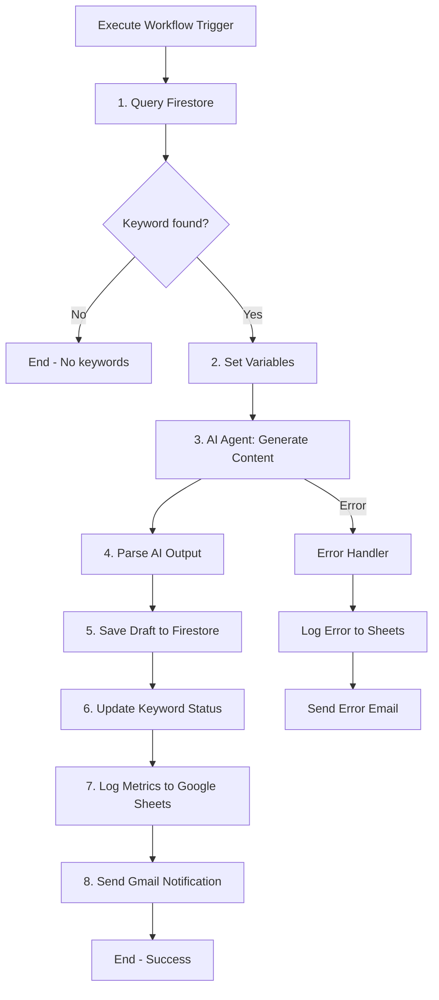
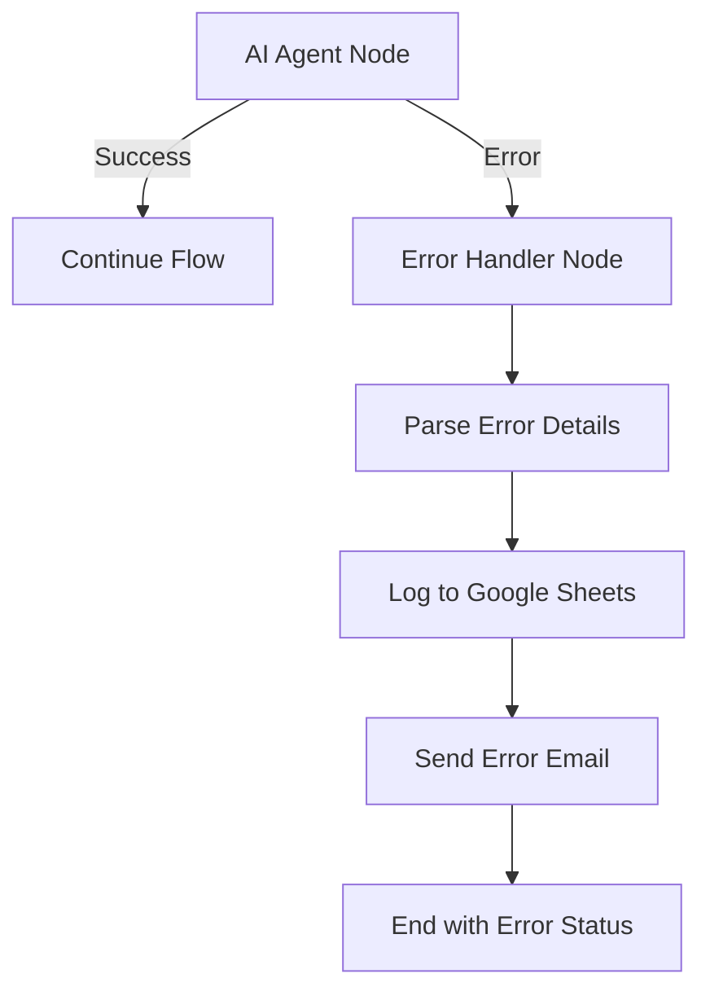

# SUB-L: Content Writer AI - Design Specification (Fase 0)

**Version:** 1.0
**Created:** 2026-01-23
**Status:** DESIGN APPROVED - READY FOR IMPLEMENTATION
**Complexity:** Medium
**Estimated Implementation:** 6-8 hours

---

## 1. PROPOSITO

Generar borradores de articulos SEO de 2,000+ palabras usando prompting reactivo (Fase 0). El workflow obtiene la siguiente keyword pendiente de Firestore, genera el contenido con Gemini 2.0 Flash, guarda el borrador con status `pending_revision`, y notifica a Juan para revision humana.

### Filosofia Fase 0: Prompting Reactivo

Segun metodologia Nate Herk:
- **NO** escribir prompts masivos desde el inicio
- **SI** empezar con prompt minimo, probar, iterar
- Agregar guardarrailes SOLO donde el sistema falle
- Fase 1 (sistema multiagente) vendra despues basado en resultados de Fase 0

---

## 2. OBJETIVOS DE NEGOCIO

1. **Velocidad:** Generar 1 borrador por semana (automatizado)
2. **Calidad:** Articulos de 2,000+ palabras con estructura SEO solida
3. **Eficiencia:** Revision humana < 15 minutos por articulo
4. **Escalabilidad:** Facilmente extensible a sistema multiagente (Fase 1)

---

## 3. ARQUITECTURA

### Diagrama de Flujo (Mermaid)



### Componentes Principales

**WORKFLOW TYPE:** AI Workflow (Nivel 3 - Nate Herk)
- Flujo predecible, secuencia fija
- IA solo para generacion de contenido (nodo especifico)
- NO es AI Agent (no necesita razonamiento dinamico)

**TRIGGER:** Execute Workflow Trigger
- Llamado por Orchestrator v2.0 como Tool
- Recibe contexto: `{ action: "generate_content", keyword_id: "kw_001" }` (opcional)

**NODOS PRINCIPALES:**
1. Execute Workflow Trigger
2. Firestore Query (obtener keyword)
3. Code Node (variables y validacion)
4. AI Agent (Gemini 2.0 Flash)
5. Code Node (parsear output IA)
6. Firestore Create (guardar draft)
7. Firestore Update (keyword status)
8. Google Sheets Append (metricas)
9. Gmail Send (notificacion)

---

## 4. NODOS REQUERIDOS

| # | Nombre del Nodo | Tipo | n8n Node Type | Proposito | Prioridad |
|---|-----------------|------|---------------|-----------|-----------|
| 1 | Execute Workflow Trigger | Trigger | `n8n-nodes-base.executeWorkflowTrigger` | Entry point del workflow | Critico |
| 2 | Query Next Keyword | Action | `n8n-nodes-base.googleFirebaseCloudFirestore` | Obtener keyword con status=pendiente | Critico |
| 3 | Check Keyword Exists | Logic | `n8n-nodes-base.if` | Validar si hay keywords disponibles | Critico |
| 4 | Set Variables | Transform | `n8n-nodes-base.set` | Extraer datos de keyword para facilitar uso | Critico |
| 5 | Content Generator Agent | AI | `@n8n/n8n-nodes-langchain.agent` | Generar articulo completo con Gemini | Critico |
| 6 | Gemini Chat Model | AI Model | `@n8n/n8n-nodes-langchain.lmChatGoogleGemini` | Modelo LLM (conectado a Agent) | Critico |
| 7 | Parse AI Output | Transform | `n8n-nodes-base.code` | Extraer title, meta, slug, content, word_count | Critico |
| 8 | Save Draft | Action | `n8n-nodes-base.googleFirebaseCloudFirestore` | Guardar en content_drafts | Critico |
| 9 | Update Keyword | Action | `n8n-nodes-base.googleFirebaseCloudFirestore` | Actualizar keyword status=en_progreso | Critico |
| 10 | Log Metrics | Action | `n8n-nodes-base.googleSheets` | Registrar en MW3_ContentWriter_Logs | Importante |
| 11 | Notify Juan | Action | `n8n-nodes-base.gmail` | Email con link al draft | Importante |
| 12 | Error Handler | Error | `n8n-nodes-base.code` | Capturar errores del AI Agent | Importante |
| 13 | Log Error | Action | `n8n-nodes-base.googleSheets` | Registrar errores en sheet separado | Opcional |

---

## 5. FLUJO DE DATOS DETALLADO

### Input (desde Orchestrator)

```json
{
  "action": "generate_content",
  "keyword_id": "kw_001",
  "force_keyword": false
}
```

**Campos:**
- `action`: Siempre "generate_content"
- `keyword_id`: (Opcional) ID especifico de keyword, sino obtiene el primero pendiente
- `force_keyword`: (Opcional) Si true, genera aunque keyword ya este en progreso

### Processing Flow

#### Paso 1: Query Next Keyword (Firestore)

**Operation:** Query
**Collection:** `keywords_pipeline`
**Filters:**
```json
{
  "status": {
    "operator": "==",
    "value": "pendiente"
  }
}
```
**Order By:** `priority_score` DESC
**Limit:** 1

**Output esperado:**
```json
{
  "keyword_id": "kw_001",
  "keyword_text": "como registrar marca software colombia",
  "volume": 320,
  "kd": 22,
  "cpc": 2.50,
  "priority_score": 85,
  "category": "registro de marca",
  "status": "pendiente",
  "created_at": "2026-01-21T07:00:00Z"
}
```

#### Paso 2: Check Keyword Exists (IF Node)

**Condition:** `{{ $json.keyword_id !== undefined }}`
- **TRUE:** Continuar a Set Variables
- **FALSE:** End workflow con mensaje "No hay keywords pendientes"

#### Paso 3: Set Variables (Set Node)

**Proposito:** Simplificar acceso a datos en nodos siguientes

**Mappings:**
```javascript
{
  "keyword_id": "={{ $json.keyword_id }}",
  "keyword_text": "={{ $json.keyword_text }}",
  "volume": "={{ $json.volume }}",
  "kd": "={{ $json.kd }}",
  "category": "={{ $json.category }}",
  "workflow_start": "={{ $now.toISO() }}"
}
```

#### Paso 4: Content Generator Agent (AI Agent Node)

**Configuration:**
- **Prompt Type:** Define below
- **Require Specific Output Format:** FALSE (Fase 0)
- **Enable Fallback Model:** FALSE

**System Prompt:**
```
Eres un experto en propiedad intelectual colombiana con 15 anos de experiencia en la Superintendencia de Industria y Comercio (SIC).

Tu tarea: Escribe un articulo de blog optimizado para SEO sobre el siguiente tema.

KEYWORD OBJETIVO: {{ $('Set Variables').item.json.keyword_text }}
CATEGORIA: {{ $('Set Variables').item.json.category }}
VOLUMEN DE BUSQUEDA: {{ $('Set Variables').item.json.volume }}/mes

REQUISITOS DEL ARTICULO:

1. ESTRUCTURA:
   - Title (H1): Debe incluir la keyword y el ano actual (2026)
   - Meta Description: 150-160 caracteres, incluir keyword y CTA
   - Introduccion: 150-200 palabras
   - Seccion "Que es [tema] y por que importa"
   - Seccion "Requisitos" o "Pasos a seguir"
   - Seccion "Costos" (si aplica para el tema)
   - Seccion "Errores comunes"
   - Seccion "Preguntas Frecuentes (FAQ)" con minimo 5 preguntas
   - Conclusion con CTA: "Agenda una consultoria gratuita con Carrillo Abogados"

2. LONGITUD: 2,000-2,500 palabras

3. AUDIENCIA: Duenos de PyMEs tecnologicas en Colombia que necesitan proteger su propiedad intelectual

4. TONO: Profesional pero accesible. Evitar jerga legal excesiva. Explicar conceptos complejos de forma simple.

5. DATOS ESPECIFICOS:
   - Incluir costos actualizados de tramites en la SIC 2026 (investiga si es necesario)
   - Mencionar tiempos reales del proceso
   - Dar ejemplos concretos aplicables a startups colombianas
   - Referencias a ley colombiana especifica (Ley 23 de 1982, Decision 486, etc)

6. SEO ON-PAGE:
   - Usar keyword en title, H1, primeros 100 palabras
   - Distribuir keyword 1-2% del contenido total
   - Usar variaciones semanticas (registro de marca, proteccion de marca, etc)
   - Incluir internal links: "Para mas informacion sobre [tema], consulta nuestro articulo sobre [X]"

7. NO INCLUIR:
   - Informacion generica que aplique a cualquier pais
   - Promesas de resultados garantizados
   - Lenguaje de venta agresivo
   - Descuentos o promociones

OUTPUT ESPERADO (formato markdown):

---
TITLE: [Tu title tag optimizado]
META_DESCRIPTION: [Tu meta description]
SLUG: [URL slug sin tildes, minusculas]
---

# [Title H1]

[Contenido del articulo en markdown con ## para H2, ### para H3, etc]

...

## Preguntas Frecuentes (FAQ)

**1. [Pregunta]**
[Respuesta]

...

## Conclusion

[Conclusion con CTA final]

---

IMPORTANTE:
- El articulo posiciona a Carrillo Abogados como expertos SIN ser un "infomercial"
- Provee valor real al lector ANTES de pedir accion
- Toda informacion debe ser factual y actualizada a 2026
```

**User Prompt:**
```
Genera el articulo completo siguiendo EXACTAMENTE la estructura solicitada.
```

**Connected Nodes:**
- **Language Model:** Google Gemini Chat Model (configurado abajo)

#### Paso 4.1: Google Gemini Chat Model

**Configuration:**
- **Model:** gemini-2.0-flash-exp
- **Temperature:** 0.7 (balance creatividad/consistencia)
- **Max Tokens:** 8000 (suficiente para 2500 palabras)
- **Credentials:** Usar credential existente `Google Gemini API` (ID: jk2FHcbAC71LuRl2)

#### Paso 5: Parse AI Output (Code Node)

**Proposito:** Extraer campos estructurados del output de IA

**JavaScript Code:**
```javascript
// Get AI output
const aiOutput = $input.first().json.output;

// Extract metadata (between --- markers)
const metaRegex = /---\n([\s\S]*?)\n---/;
const metaMatch = aiOutput.match(metaRegex);
let title = "";
let metaDescription = "";
let slug = "";

if (metaMatch) {
  const metaBlock = metaMatch[1];
  const titleMatch = metaBlock.match(/TITLE:\s*(.+)/);
  const metaMatch2 = metaBlock.match(/META_DESCRIPTION:\s*(.+)/);
  const slugMatch = metaBlock.match(/SLUG:\s*(.+)/);

  title = titleMatch ? titleMatch[1].trim() : "Sin titulo";
  metaDescription = metaMatch2 ? metaMatch2[1].trim() : "Sin meta description";
  slug = slugMatch ? slugMatch[1].trim() : "sin-slug";
}

// Extract content (after metadata block)
const contentRegex = /---\n[\s\S]*?\n---\n([\s\S]+)/;
const contentMatch = aiOutput.match(contentRegex);
const content = contentMatch ? contentMatch[1].trim() : aiOutput;

// Calculate word count
const wordCount = content.split(/\s+/).filter(word => word.length > 0).length;

// Get keyword data from previous node
const keywordData = $('Set Variables').first().json;

return [{
  json: {
    content_id: `draft_${Date.now()}`,
    keyword_id: keywordData.keyword_id,
    title: title,
    meta_description: metaDescription,
    slug: slug,
    content_markdown: content,
    word_count: wordCount,
    status: "pending_revision",
    reviewer_notes: "",
    published_url: null,
    created_at: new Date().toISOString(),
    approved_at: null,
    approved_by: null,
    // Metadata for tracking
    ai_model: "gemini-2.0-flash-exp",
    generation_metadata: {
      keyword_text: keywordData.keyword_text,
      category: keywordData.category,
      volume: keywordData.volume
    }
  }
}];
```

#### Paso 6: Save Draft (Firestore)

**Operation:** Create
**Collection:** `content_drafts`
**Document ID:** `{{ $json.content_id }}`
**Data:** `{{ $json }}` (todo el objeto del paso anterior)

#### Paso 7: Update Keyword (Firestore)

**Operation:** Update
**Collection:** `keywords_pipeline`
**Document ID:** `{{ $('Set Variables').item.json.keyword_id }}`
**Fields to Update:**
```json
{
  "status": "en_progreso",
  "content_id": "{{ $('Parse AI Output').item.json.content_id }}",
  "updated_at": "{{ $now.toISO() }}"
}
```

#### Paso 8: Log Metrics (Google Sheets)

**Operation:** Append
**Document ID:** (ID del sheet `MW3_ContentWriter_Logs`)
**Sheet Name:** `Logs`

**Values:**
```javascript
[
  "={{ $now.format('yyyy-MM-dd HH:mm:ss') }}",
  "={{ $('Set Variables').item.json.keyword_id }}",
  "={{ $('Set Variables').item.json.keyword_text }}",
  "={{ $('Parse AI Output').item.json.content_id }}",
  "={{ $('Parse AI Output').item.json.word_count }}",
  "={{ $('Parse AI Output').item.json.status }}",
  "SUCCESS",
  "={{ $execution.duration }}"
]
```

**Sheet Columns:**
| A | B | C | D | E | F | G | H |
|---|---|---|---|---|---|---|---|
| Timestamp | Keyword ID | Keyword Text | Content ID | Word Count | Status | Result | Duration (ms) |

#### Paso 9: Notify Juan (Gmail)

**Operation:** Send
**To:** marketing@carrilloabgd.com
**Subject:** `Nuevo borrador SEO listo: {{ $('Parse AI Output').item.json.title }}`

**Body (HTML):**
```html
<h2>Borrador de Contenido Generado</h2>

<p>Hola Juan,</p>

<p>Se ha generado un nuevo borrador de articulo SEO que requiere tu revision.</p>

<h3>Detalles del Articulo:</h3>
<ul>
  <li><strong>Keyword:</strong> {{ $('Set Variables').item.json.keyword_text }}</li>
  <li><strong>Categoria:</strong> {{ $('Set Variables').item.json.category }}</li>
  <li><strong>Titulo:</strong> {{ $('Parse AI Output').item.json.title }}</li>
  <li><strong>Palabras:</strong> {{ $('Parse AI Output').item.json.word_count }}</li>
  <li><strong>Content ID:</strong> {{ $('Parse AI Output').item.json.content_id }}</li>
</ul>

<h3>Metricas de la Keyword:</h3>
<ul>
  <li><strong>Volumen:</strong> {{ $('Set Variables').item.json.volume }}/mes</li>
  <li><strong>Dificultad:</strong> {{ $('Set Variables').item.json.kd }}</li>
</ul>

<p>Para revisar el borrador:</p>
<ol>
  <li>Abre Firebase Console: <a href="https://console.firebase.google.com">https://console.firebase.google.com</a></li>
  <li>Ve a Firestore > content_drafts</li>
  <li>Busca el documento: <code>{{ $('Parse AI Output').item.json.content_id }}</code></li>
  <li>Revisa el campo <code>content_markdown</code></li>
</ol>

<p><strong>Proximos pasos:</strong></p>
<ul>
  <li>Revisar contenido (factualidad, tono, SEO)</li>
  <li>Editar si es necesario</li>
  <li>Cambiar status a "approved" para publicar (SUB-M)</li>
  <li>O cambiar a "rejected" con notas en <code>reviewer_notes</code></li>
</ul>

<p>Tiempo estimado de revision: 10-15 minutos</p>

<hr>
<p><em>Este email fue generado automaticamente por SUB-L: Content Writer AI (MW#3)</em></p>
```

---

## 6. INTEGRACIONES

### Google Firestore

**Project:** `carrillo-marketing-core`
**Database:** `(default)`

**Collections utilizadas:**

1. **keywords_pipeline** (READ, UPDATE)
   - Query: Obtener siguiente keyword pendiente
   - Update: Cambiar status a "en_progreso"

2. **content_drafts** (CREATE)
   - Create: Guardar nuevo borrador con status "pending_revision"

### Google Gemini API

**Model:** gemini-2.0-flash-exp
**Credential:** `Google Gemini API` (ID: jk2FHcbAC71LuRl2)
**Estimated Cost:** ~$0.01 por articulo (2500 palabras = ~3000 tokens output)

### Gmail API

**Credential:** `Gmail OAuth2` (ID: l2mMgEf8YUV7HHlK)
**Sender:** marketing@carrilloabgd.com
**Recipient:** marketing@carrilloabgd.com (Juan)

### Google Sheets

**Document ID:** (Crear sheet `MW3_ContentWriter_Logs`)
**Sheet Names:**
- `Logs`: Registro de ejecuciones exitosas
- `Errors`: Registro de errores (si aplica)

---

## 7. CREDENCIALES REQUERIDAS

| Servicio | Credential ID | Estado | Notas |
|----------|---------------|--------|-------|
| Google Gemini API | `jk2FHcbAC71LuRl2` | Activo | Ya configurado en MW#1 |
| Gmail OAuth2 | `l2mMgEf8YUV7HHlK` | Activo | Ya configurado en MW#1 |
| Google Firestore | `AAhdRNGzvsFnYN9O` | Activo | Ya configurado en MW#1 |
| Google Sheets OAuth2 | (Verificar) | Activo | Ya configurado en MW#1 |

**Nota:** Todas las credenciales ya existen en n8n Cloud. No se requiere configuracion adicional.

---

## 8. MANEJO DE ERRORES

### Error Handling Strategy



### Error Handler (Code Node)

**Trigger:** On Error of "Content Generator Agent"

**JavaScript Code:**
```javascript
const error = $input.first().json.error || $input.first().json;
const keywordData = $('Set Variables').first().json;

return [{
  json: {
    timestamp: new Date().toISOString(),
    keyword_id: keywordData.keyword_id,
    keyword_text: keywordData.keyword_text,
    error_type: error.name || "UnknownError",
    error_message: error.message || JSON.stringify(error),
    error_stack: error.stack || "",
    workflow_execution_id: $execution.id,
    resolution_status: "pending"
  }
}];
```

### Error Email Template

**To:** marketing@carrilloabgd.com
**Subject:** `ERROR: SUB-L Content Writer - {{ $('Set Variables').item.json.keyword_text }}`

**Body:**
```
ERROR EN GENERACION DE CONTENIDO

Keyword: {{ $('Set Variables').item.json.keyword_text }}
Keyword ID: {{ $('Set Variables').item.json.keyword_id }}

Error: {{ $json.error_message }}

Execution ID: {{ $execution.id }}

Accion requerida: Revisar workflow en n8n Cloud y retry manualmente.
```

---

## 9. VALIDACION DE VIABILIDAD

### Recursos Disponibles

| Recurso | Estado | Nota |
|---------|--------|------|
| n8n Cloud activo | Activo | Plan con AI nodes |
| GCP Firestore configurado | Activo | Collections ya existen en MW#1 |
| Google Gemini API key | Activo | Mismo que MW#1 |
| Gmail OAuth2 | Activo | Mismo que MW#1 |
| Google Sheets OAuth2 | Activo | Mismo que MW#1 |

### Posibles Limitaciones

| Limitacion | Impacto | Mitigacion |
|------------|---------|------------|
| Gemini output inconsistente | Medio | Fase 0 acepta, iterar prompt basado en resultados reales |
| Falta de datos especificos SIC | Bajo | Prompt pide investigacion, Fase 1 agregara Perplexity API |
| Tiempo de generacion > 60s | Bajo | Aumentar timeout del AI Agent node a 180s |
| Costo por articulo alto | Bajo | Gemini 2.0 Flash es $0.01/articulo, muy barato |

### Alternativas Consideradas

| Decision | Alternativas descartadas | Razon |
|----------|--------------------------|-------|
| LLM: Gemini 2.0 Flash | Claude 3.5 Sonnet, GPT-4 | Costo (Gemini 10x mas barato) + integracion ecosistema Google |
| Trigger: Execute Workflow | Schedule Trigger | Mejor control desde Orchestrator, permite llamadas bajo demanda |
| Output parsing: Code Node | Structured Output Parser | Fase 0 mantiene simple, Fase 1 agregara parser si es necesario |

---

## 10. ESTIMACION

### Complejidad
**MEDIA** - Workflow con IA pero flujo predecible

### Tiempo de Implementacion
**6-8 horas** distribuidas asi:
- Setup nodos basicos: 1h
- Configuracion AI Agent + Gemini: 2h
- Firestore queries y updates: 1.5h
- Code nodes (parsing, error handling): 1.5h
- Gmail + Google Sheets: 1h
- Testing end-to-end: 2-3h

### Nodos Totales
**13 nodos** (incluyendo error handling)

### Sub-workflows Dependientes
- **Llamado por:** Orchestrator v2.0 (via Tool)
- **Llama a:** Ninguno (es spoke terminal)

---

## 11. METRICAS DE EXITO

### Criterios de Aceptacion (Fase 0)

| Criterio | Target | Como Medir |
|----------|--------|------------|
| Tiempo generacion | < 90s | Duracion ejecucion workflow |
| Longitud articulo | 2,000-2,500 palabras | word_count en output |
| Estructura correcta | 100% | Checklist manual: tiene H1, H2, FAQ, conclusion |
| Tiempo revision humana | < 15 min | Feedback de Juan |
| Tasa de aprobacion | > 70% | drafts aprobados / drafts generados |

### Metricas de Observabilidad

Registradas en Google Sheets:
- Timestamp de cada ejecucion
- Keyword procesada
- Word count generado
- Duracion total (ms)
- Success/Error status

### Criterios de Transicion a Fase 1

Considerar sistema multiagente cuando:
1. Fase 0 genera borradores consistentemente
2. Tiempo de revision humana > 30 min/articulo (mucha edicion)
3. Tasa de aprobacion < 70% (calidad baja)
4. Se necesita research actualizado (costos SIC 2026, jurisprudencia)

---

## 12. PROXIMOS PASOS

### Para Handoff al Agente Ingeniero

1. Este documento `DESIGN_SPEC.md` contiene toda la especificacion tecnica
2. Implementar el JSON del workflow basandose en esta spec
3. Crear el Google Sheet `MW3_ContentWriter_Logs` con columnas especificadas
4. Probar con keyword de prueba en Firestore (crear `keywords_pipeline` si no existe)
5. Validar que email llegue correctamente a Juan
6. Documentar el workflow ID y webhook en STATUS.md

### Estructura de Archivos Esperada

```
02-spokes/sub-l-content-writer/
├── DESIGN_SPEC.md (este archivo)
├── SUB-L_Content_Writer_v1.json (a crear por ingeniero)
└── test-data/
    ├── sample_keyword.json
    └── sample_ai_output.json
```

### Checklist Pre-Implementacion

- [x] Todos los nodos identificados y documentados
- [x] Configuracion de AI Agent especificada
- [x] System Prompt refinado para Fase 0
- [x] Estructura Firestore documentada
- [x] Error handling planificado
- [x] Metricas de exito definidas
- [ ] Google Sheet creado (pendiente ingeniero)
- [ ] Workflow JSON implementado (pendiente ingeniero)
- [ ] Testing end-to-end (pendiente QA)

---

## 13. REFERENCIAS

### Documentos Relacionados

| Documento | Ubicacion | Relevancia |
|-----------|-----------|-----------|
| MW#3 STATUS.md | `../../../STATUS.md` | Estado actual del MW#3 |
| Arquitectura MW#3 | `../../../../docs/technical/arquitectura/03_MEGA_WORKFLOW_3_SEO.md` | Vision general del sistema |
| Agent Protocols | `../../../../docs/01_AGENT_PROTOCOLS.md` | Estandares de desarrollo |
| Nate Herk Methodology | Seccion 0.4 en arquitectura | Principios de AI workflows |

### Workflows de Referencia

| Workflow | ID | Razon |
|----------|------|-------|
| SUB-A Lead Intake (MW#1) | `RHj1TAqBazxNFriJ` | Patron Execute Workflow Trigger + AI + Firestore |
| Orquestador v3.0 (MW#1) | `68DDbpQzOEIweiBF` | AI Agent architecture (referencia para Fase 1) |

---

**Fin del Documento**
**Estado:** DESIGN APPROVED
**Siguiente Accion:** Handoff a Agente Ingeniero para implementacion

---

## APENDICE A: System Prompt Alternatives (Para Iteracion)

Si el prompt inicial no genera resultados satisfactorios, considerar estas variaciones:

### Variacion 1: Mas Estructurado
```
Eres un Content Writer experto en PI colombiana.

PASO 1: Lee la keyword objetivo
PASO 2: Define estructura del articulo
PASO 3: Genera introduccion
PASO 4: Desarrolla cada seccion
PASO 5: Escribe FAQ
PASO 6: Conclusion con CTA

[Resto del prompt igual]
```

### Variacion 2: Menos Prescriptivo
```
Eres experto en PI colombiana.

Escribe un articulo SEO de 2000+ palabras sobre: [KEYWORD]

Audiencia: Duenos de PyMEs tecnologicas en Colombia

Incluye: introduccion, requisitos, costos, FAQ, conclusion con CTA a Carrillo Abogados.

Tono: Profesional pero accesible.

[Sin especificar estructura H2/H3 rigida]
```

### Variacion 3: Con Few-Shot Example
```
Eres experto en PI colombiana.

Aqui hay un ejemplo de articulo de alta calidad:

[Insertar fragmento de articulo de referencia]

Ahora, escribe un articulo similar sobre: [KEYWORD]

[Resto del prompt]
```

**Decision Fase 0:** Empezar con prompt principal (mas estructurado). Solo probar variaciones si resultados son insatisfactorios.

---

## APENDICE B: Firestore Schema Validation

### Collection: keywords_pipeline

**Required fields:**
```javascript
{
  keyword_id: string,
  keyword_text: string,
  volume: number,
  kd: number,
  priority_score: number,
  status: "pendiente" | "en_progreso" | "publicado",
  created_at: timestamp
}
```

**Indexes needed:**
- Composite: status (ASC) + priority_score (DESC)

### Collection: content_drafts

**Required fields:**
```javascript
{
  content_id: string,
  keyword_id: string,
  title: string,
  meta_description: string,
  slug: string,
  content_markdown: string,
  word_count: number,
  status: "pending_revision" | "approved" | "rejected" | "published",
  created_at: timestamp
}
```

**Indexes needed:**
- Single: status (ASC)
- Single: created_at (DESC)

---

**Version History:**
- v1.0 (2026-01-23): Initial design specification
