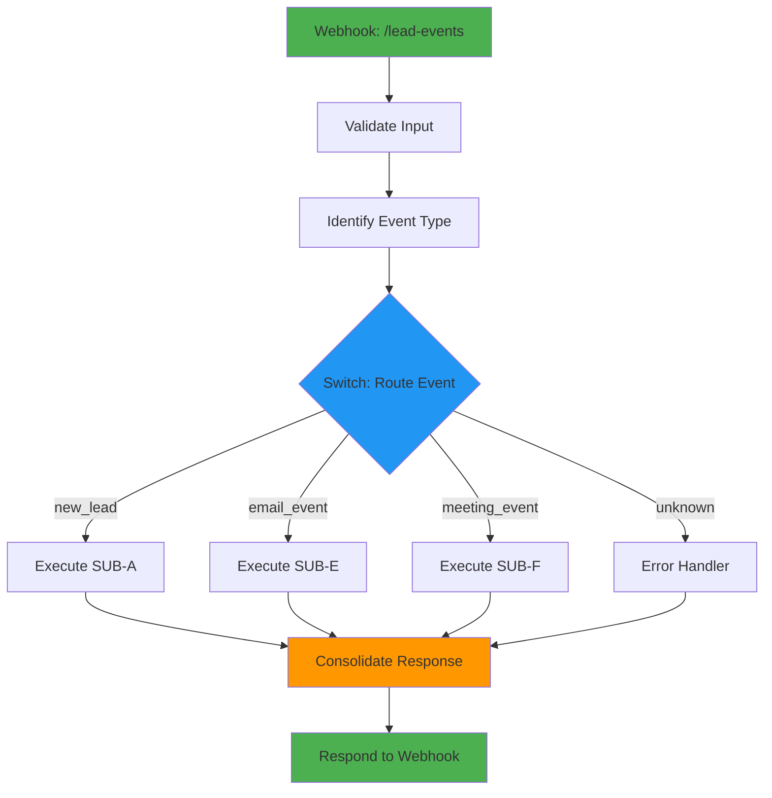

# VALIDACION DE ARQUITECTURA: WORKFLOW ORQUESTADOR (HUB)
## Reporte de Análisis Técnico del Diseño

**Proyecto:** MEGA-WORKFLOW #1 - Lead Lifecycle Manager
**Cliente:** Carrillo Abogados
**Analista:** Agente Arquitecto (Claude - Sonnet 4.5)
**Fecha:** 2026-01-02
**Workflow ID:** `bva1Kc1USbbITEAw`
**Versión analizada:** Production (2025-12-21)

---

## 1. RESUMEN EJECUTIVO

### 1.1 Evaluación General

| Aspecto | Calificación | Estado |
|---------|--------------|--------|
| **Arquitectura Hub & Spoke** | 9/10 | Bien implementado |
| **Adherencia a best practices** | 8/10 | Bueno con mejoras posibles |
| **Escalabilidad** | 7/10 | Limitaciones identificadas |
| **Mantenibilidad** | 8/10 | Código limpio, falta documentación inline |
| **Preparación para integración** | 6/10 | Requiere mejoras para spokes futuros |

**Conclusión:** El orquestador actual cumple con los requisitos de la arquitectura Hub & Spoke y está OPERATIVO en producción. Sin embargo, presenta limitaciones que afectarán la integración con spokes futuros (SUB-D, SUB-E, SUB-F). Se recomienda implementar las mejoras propuestas antes de escalar.

---

## 2. ANÁLISIS DE ARQUITECTURA HUB & SPOKE

### 2.1 Fortalezas del Diseño Actual

#### 2.1.1 Simplicidad Efectiva

**Observación:** El orquestador tiene solo 5 nodos, lo cual es EXCELENTE para un Hub.

```
[Webhook] → [Identify] → [SubA] → [Consolidate] → [Respond]
```

**Ventajas:**
- Fácil de debuggear
- Latencia mínima (no hay sobrecarga)
- Diagrama visual claro en n8n
- Mantenimiento simple

**Calificación:** 10/10

#### 2.1.2 Separación de Responsabilidades

**Observación:** El orquestador NO procesa la lógica de negocio, solo enruta.

```javascript
// Nodo "Identify" - Solo clasificación, no procesamiento
if (eventType === 'new_lead' || (payload.email && !payload.lead_id)) {
  eventType = 'new_lead';
  targetWorkflowId = 'RHj1TAqBazxNFriJ';
}
```

**Ventajas:**
- Toda la lógica compleja está en SUB-A
- El orquestador es agnóstico al dominio
- Fácil agregar nuevos tipos de eventos sin tocar lógica de negocio

**Calificación:** 9/10

#### 2.1.3 Metadata de Trazabilidad

**Observación:** Enriquece el payload con metadata del orquestador.

```javascript
{
  orchestrator_timestamp: new Date().toISOString(),
  orchestrator_execution_id: $execution.id
}
```

**Ventajas:**
- Auditoría completa del flujo
- Debugging facilitado (saber desde qué ejecución del orquestador vino)
- Permite correlacionar eventos entre workflows

**Calificación:** 9/10

#### 2.1.4 Configuración de Settings

**Observación:** Settings del workflow bien configurados:

```json
{
  "executionOrder": "v1",
  "saveDataErrorExecution": "all",
  "saveDataSuccessExecution": "all",
  "saveManualExecutions": true,
  "saveExecutionProgress": true,
  "callerPolicy": "workflowsFromSameOwner"
}
```

**Ventajas:**
- Logs completos de errores y éxitos (crítico para producción)
- Seguridad: Solo workflows del mismo owner pueden llamarlo
- Permite debugging histórico

**Calificación:** 10/10

---

### 2.2 Debilidades y Limitaciones Críticas

#### 2.2.1 CRÍTICO: Falta el Router (Switch Node)

**Problema:** Actualmente el orquestador ejecuta SIEMPRE el SUB-A, sin importar el `event_type`.

**Arquitectura documentada:**
```
[Identify] → [Switch] → {
    new_lead → SubA
    email_opened → SubE
    meeting_booked → SubF
}
```

**Implementación actual:**
```
[Identify] → [SubA] → ...
```

**Impacto:**
- NO se pueden agregar SUB-D, SUB-E, SUB-F sin rehacer el orquestador
- Eventos de email/meeting serían procesados incorrectamente por SUB-A
- Hardcoded workflow ID en el código del nodo "Identify"

**Evidencia del código:**
```javascript
// Línea 7 de function_router.js - HARDCODED
targetWorkflowId = 'RHj1TAqBazxNFriJ';
```

**Recomendación:** Agregar nodo Switch INMEDIATAMENTE antes de integrar más spokes.

**Severidad:** ALTA
**Calificación:** 2/10 (no cumple spec original)

---

#### 2.2.2 ALTO: Hardcoding de Workflow IDs

**Problema:** El ID del SUB-A está hardcoded en 2 lugares:

1. En el nodo "Identify" (Code):
```javascript
targetWorkflowId = 'RHj1TAqBazxNFriJ';
```

2. En el nodo "SubA" (Execute Workflow):
```json
"workflowId": {
  "value": "RHj1TAqBazxNFriJ"
}
```

**Impacto:**
- Si se duplica/renombra SUB-A, hay que actualizar en 2 lugares
- Propenso a errores de sincronización
- Dificulta el testing (no puedes cambiar a versión de prueba fácilmente)

**Mejor práctica (n8n):**
- Usar variables de entorno: `{{ $env.SUB_A_WORKFLOW_ID }}`
- O mejor: Que el nodo Switch ejecute directamente (no necesita ID en el Code node)

**Recomendación:** Eliminar hardcoding del nodo Code, dejar que el Switch maneje el routing.

**Severidad:** MEDIA
**Calificación:** 4/10

---

#### 2.2.3 MEDIO: Falta Error Handling Explícito

**Problema:** No hay ruta de fallback si el SUB-A falla.

**Arquitectura documentada:**
```
Switch:
  └── fallback → Error Handler
```

**Implementación actual:**
- Sin Switch, no hay fallback
- Si SUB-A falla, el error "burbujea" al orquestador
- El nodo "Consolidate" asume que `$json.success !== false` (pero no valida estructura)

**Evidencia:**
```javascript
// Nodo "Consolidate" - Asunción optimista
"value": "={{ $json.success !== false }}"
```

**Escenarios problemáticos:**
1. SUB-A retorna `null` (nodo roto)
2. SUB-A retorna string en vez de objeto
3. SUB-A timeout sin respuesta

**Impacto:**
- El webhook devolvería un error 500 sin mensaje claro
- No hay logs estructurados del tipo de fallo
- El usuario del formulario recibe error genérico

**Recomendación:** Agregar nodo de error handling que capture fallos de SUB-A y retorne respuesta consistente.

**Severidad:** MEDIA
**Calificación:** 5/10

---

#### 2.2.4 MEDIO: Falta Validación de Input del Webhook

**Problema:** El orquestador NO valida que el payload del webhook sea correcto.

**Código actual (nodo Identify):**
```javascript
const input = $input.first().json;
const payload = input.body || input;
```

**Preguntas sin responder:**
- ¿Qué pasa si el payload está vacío?
- ¿Qué pasa si no hay campo `email` ni `event_type`?
- ¿Qué pasa si el JSON está mal formado?

**Impacto:**
- Ejecuta SUB-A con datos inválidos
- SUB-A debe validar (duplicación de lógica)
- Logs confusos si el problema está en el payload

**Best practice:**
```javascript
// Validación básica en el orquestador
if (!payload || typeof payload !== 'object') {
  throw new Error('Invalid payload: must be JSON object');
}

if (!payload.event_type && !payload.email) {
  throw new Error('Invalid payload: missing event_type or email');
}
```

**Recomendación:** Agregar nodo de validación ANTES del Switch.

**Severidad:** MEDIA
**Calificación:** 6/10

---

#### 2.2.5 BAJO: Response Body No Incluye Metadata del Orquestador

**Problema:** La respuesta del webhook NO incluye metadata útil del orquestador.

**Código actual (nodo Respond):**
```javascript
"responseBody": "={{ { success: $json.success, result: $json.result } }}"
```

**Falta:**
- `event_type` (¿qué evento procesó?)
- `sub_workflow_executed` (¿qué spoke se ejecutó?)
- `execution_time_ms` (¿cuánto tardó?)
- `orchestrator_execution_id` (para debugging)

**Comparación con spec original:**
```json
{
  "success": true,
  "event_type": "new_lead",
  "sub_workflow_executed": "SUB_A_WORKFLOW_ID",
  "execution_time_ms": 3542,
  "result": { ... }
}
```

**Impacto:**
- El cliente del webhook recibe menos información
- Debugging más difícil (no sabe qué spoke procesó)
- No hay métricas de latencia

**Recomendación:** Enriquecer respuesta del webhook según spec original.

**Severidad:** BAJA
**Calificación:** 6/10

---

## 3. INTEGRACIÓN CON SPOKES

### 3.1 Compatibilidad con SUB-A (Actual)

| Aspecto | Estado | Comentario |
|---------|--------|------------|
| **Execute Workflow Node** | ✅ Correcto | Configurado con `waitForSubWorkflow: true` |
| **Passing Data** | ⚠️ Parcial | Pasa TODO el objeto (bueno), pero SUB-A debe mapear |
| **Response Handling** | ✅ Correcto | Consolida respuesta de SUB-A |
| **Error Handling** | ⚠️ Parcial | Falta catch explícito de errores de SUB-A |

**Calificación:** 7/10

---

### 3.2 Preparación para Spokes Futuros

#### SUB-D (Nurturing Sequence Engine)

**Estado:** NO PREPARADO

**Problemas:**
1. No hay `email_opened` ni `meeting_booked` en el Switch (porque no hay Switch)
2. No hay lógica de enrutamiento para eventos de Mailersend
3. No hay validación de estructura de eventos de Mailersend

**Necesario antes de integrar:**
- Agregar Switch con rutas para `nurturing_trigger`
- Definir payload esperado de SUB-D
- Configurar timeout (SUB-D puede tardar minutos en ejecutar batch)

---

#### SUB-E (Engagement Tracker)

**Estado:** NO PREPARADO

**Problemas:**
1. No hay webhook dedicado para eventos de Mailersend
2. No hay parsing de payload de Mailersend (estructura diferente a formulario web)
3. No hay lógica de enrutamiento

**Necesario antes de integrar:**
- Agregar parsing de eventos de Mailersend en nodo Identify
- Agregar ruta en Switch para `email_opened`, `email_clicked`
- Decidir: ¿SUB-E se ejecuta desde orquestador o tiene webhook propio?

**Recomendación (arquitectura):** SUB-E debería tener su propio webhook dedicado porque:
- Mailersend envía estructura de payload muy diferente
- Alta frecuencia de eventos (puede saturar orquestador)
- No requiere respuesta inmediata (puede ser async)

---

#### SUB-F (Meeting Scheduler)

**Estado:** NO PREPARADO

**Problemas:** Similares a SUB-E.

**Recomendación (arquitectura):** SUB-F debería tener su propio webhook porque:
- Calendly tiene su propia estructura de webhook
- Requiere validación de signature (seguridad)
- No requiere orquestación compleja (solo procesamiento lineal)

---

### 3.3 Recomendación de Arquitectura Revisada

**Propuesta:** Dividir en 2 tipos de orquestación:

```
FORMULARIO WEB ──► Orquestador (actual)
                      └── SUB-A

MAILERSEND ──────► Webhook Dedicado SUB-E
                      └── Procesa internamente
                      └── Si necesita, llama SUB-D

CALENDLY ────────► Webhook Dedicado SUB-F
                      └── Procesa internamente
```

**Ventajas:**
- Cada webhook tiene su lógica de validación específica
- No hay overhead del orquestador para eventos externos
- Más fácil de debuggear
- Permite rate limiting por fuente

**Desventajas:**
- Más URLs de webhook que gestionar
- Menos "centralización" (pero la centralización por el orquestador NO es necesaria para estos casos)

**Calificación de preparación:** 3/10

---

## 4. ADHERENCIA A BEST PRACTICES

### 4.1 Nomenclatura de Nodos

| Nodo | Nombre Actual | Best Practice | Calificación |
|------|---------------|---------------|--------------|
| 1 | `Webhook Principal Lead Events` | ✅ Descriptivo | 9/10 |
| 2 | `Identify` | ⚠️ Poco descriptivo | 6/10 (mejor: "Classify Event Type") |
| 3 | `SubA` | ⚠️ Poco descriptivo | 5/10 (mejor: "Execute Lead Intake") |
| 4 | `Consolidate` | ✅ Descriptivo | 8/10 |
| 5 | `Respond` | ✅ Descriptivo | 8/10 |

**Recomendación:** Renombrar nodos 2 y 3 para mayor claridad.

**Calificación general:** 7/10

---

### 4.2 Código JavaScript (Nodo "Identify")

**Análisis del código actual:**

```javascript
const input = $input.first().json;
const payload = input.body || input;
let eventType = payload.event_type || 'unknown';
let targetWorkflowId = null;

if (eventType === 'new_lead' || (payload.email && !payload.lead_id)) {
  eventType = 'new_lead';
  targetWorkflowId = 'RHj1TAqBazxNFriJ';
} else if (eventType === 'email_opened') {
  eventType = 'email_opened';
}

return {
  json: {
    ...payload,
    event_type: eventType,
    target_workflow_id: targetWorkflowId,
    orchestrator_timestamp: new Date().toISOString(),
    orchestrator_execution_id: $execution.id
  }
};
```

**Fortalezas:**
- ✅ Maneja `input.body || input` (compatible con diferentes sources)
- ✅ Spread operator preserva payload original
- ✅ Agrega metadata útil

**Debilidades:**
- ⚠️ Hardcoded workflow ID
- ⚠️ No maneja caso `email_opened` (qué workflow ejecuta?)
- ⚠️ No valida estructura de payload
- ⚠️ No hay logging de eventos desconocidos

**Mejoras propuestas:**

```javascript
const input = $input.first().json;
const payload = input.body || input;

// VALIDACIÓN
if (!payload || typeof payload !== 'object') {
  throw new Error('Invalid payload: must be JSON object');
}

// CLASIFICACIÓN
let eventType = payload.event_type || 'unknown';

// Inferencia si no hay event_type explícito
if (eventType === 'unknown') {
  if (payload.email && !payload.lead_id) {
    eventType = 'new_lead';
  } else if (payload.mailersend_event) {
    eventType = 'email_event';
  } else if (payload.calendly_event) {
    eventType = 'meeting_event';
  }
}

// METADATA
return {
  json: {
    ...payload,
    event_type: eventType,
    orchestrator_timestamp: new Date().toISOString(),
    orchestrator_execution_id: $execution.id,
    orchestrator_version: '1.0'
  }
};
```

**Calificación:** 6/10 (funcional pero mejorable)

---

### 4.3 Manejo de Errores

**Problema:** No hay try-catch en el nodo Code.

**Riesgo:**
- Si `payload.event_type` causa excepción (ej: payload es `null`), el workflow explota
- No hay mensaje de error claro

**Mejora propuesta:**

```javascript
try {
  const input = $input.first().json;
  const payload = input.body || input;

  // ... lógica actual

} catch (error) {
  return {
    json: {
      success: false,
      error_type: 'orchestrator_parsing_error',
      error_message: error.message,
      event_type: 'error',
      orchestrator_timestamp: new Date().toISOString()
    }
  };
}
```

**Calificación:** 5/10

---

### 4.4 Timeout y Performance

**Observación:** No hay configuración de timeout en el nodo Execute Workflow.

**Riesgo:**
- Si SUB-A se cuelga, el webhook queda esperando indefinidamente
- El cliente del formulario recibe timeout genérico

**Best practice:**

```json
{
  "options": {
    "waitForSubWorkflow": true,
    "timeout": 30000  // 30 segundos
  }
}
```

**Calificación:** 6/10

---

## 5. ESCALABILIDAD Y MANTENIBILIDAD

### 5.1 Escalabilidad a Mayor Volumen

| Aspecto | Límite Actual | Riesgo | Mitigación |
|---------|---------------|--------|------------|
| **Leads/mes** | ~300 | Bajo | n8n Cloud maneja miles de ejecuciones |
| **Latencia** | ~3-8 seg | Medio | Si SUB-A demora, timeout del webhook |
| **Concurrencia** | Sin límite configurado | Alto | n8n puede ejecutar múltiples instancias del orquestador en paralelo |

**Recomendación:**
- Configurar timeout en Execute Workflow (30 seg)
- Monitorear latencia de SUB-A (si > 10 seg, refactorizar)
- Considerar patrón async para SUB-D (no bloquear respuesta del webhook)

**Calificación:** 7/10

---

### 5.2 Mantenibilidad del Código

| Aspecto | Calificación | Comentario |
|---------|--------------|------------|
| **Documentación inline** | 3/10 | El código NO tiene comentarios |
| **Nombres de variables** | 7/10 | Claros pero podrían mejorar |
| **Modularidad** | 9/10 | Bien separado en nodos |
| **Consistencia** | 8/10 | Estilo uniforme |

**Recomendación:** Agregar comentarios al código JavaScript.

**Calificación general:** 7/10

---

### 5.3 Testing y Debugging

| Aspecto | Estado | Comentario |
|---------|--------|------------|
| **Logs de ejecución** | ✅ Excelente | `saveDataSuccessExecution: "all"` |
| **Trazabilidad** | ✅ Buena | Metadata de execution_id |
| **Testing manual** | ✅ Posible | Webhook puede llamarse con cURL |
| **Testing automatizado** | ⚠️ No configurado | No hay tests unitarios |

**Recomendación:** Crear colección de Postman/Insomnia con casos de prueba.

**Calificación:** 7/10

---

## 6. CONSIDERACIONES PARA INTEGRACION CON SPOKES

### 6.1 Contrato de Interfaz (Input/Output)

#### Input esperado por el Orquestador

**Formato:**
```json
{
  "event_type": "new_lead" | "email_opened" | "meeting_booked",
  // ... resto del payload específico
}
```

**Problema:** No está documentado formalmente.

**Recomendación:** Crear schema JSON en la documentación.

---

#### Output esperado de los Spokes

**Formato esperado (según nodo Consolidate):**
```json
{
  "success": boolean,
  // ... resto de campos
}
```

**Problema:** SUB-A retorna campos adicionales (`lead_id`, `score`, `categoria`) que NO son validados.

**Recomendación:** Definir schema estricto de respuesta de spokes.

---

### 6.2 Patrones de Comunicación

**Actual:** Sincrónico (waitForSubWorkflow: true)

**Ventajas:**
- Simple de implementar
- Usuario recibe confirmación inmediata

**Desventajas:**
- Si SUB-A demora, timeout
- No escala bien para procesos largos (ej: SUB-D)

**Recomendación para SUB-D:**
- Cambiar a patrón asincrónico
- Orquestador responde inmediatamente
- SUB-D procesa en background
- Notifica completion via webhook interno

---

### 6.3 Error Handling entre Orquestador y Spokes

**Escenarios no manejados:**

1. **Spoke retorna error pero no falla**
   - SUB-A retorna `{ success: false }`
   - Orquestador lo pasa al nodo Consolidate
   - Se devuelve HTTP 500 (correcto)
   - PERO: No hay log estructurado del error

2. **Spoke falla completamente (timeout/crash)**
   - Execute Workflow lanza excepción
   - Workflow explota
   - Webhook devuelve error genérico de n8n

3. **Spoke retorna formato inesperado**
   - SUB-A retorna `"success"` (string) en vez de boolean
   - Consolidate no valida
   - Se devuelve respuesta malformada

**Recomendación:** Agregar nodo de validación de respuesta de spokes.

---

## 7. RECOMENDACIONES PRIORITARIAS

### 7.1 CRÍTICAS (Implementar ANTES de agregar más spokes)

1. **Agregar nodo Switch**
   - Ubicación: Entre "Identify" y "SubA"
   - Rutas: `new_lead`, `email_event`, `meeting_event`, fallback
   - Tiempo estimado: 1 hora

2. **Eliminar hardcoding de workflow IDs**
   - Usar variables de entorno o que el Switch ejecute directamente
   - Tiempo estimado: 30 min

3. **Agregar error handling explícito**
   - Nodo después de Execute Workflows
   - Captura errores de spokes
   - Tiempo estimado: 1 hora

**Total tiempo estimado:** 2.5 horas

---

### 7.2 ALTAS (Mejorar calidad general)

4. **Agregar validación de input del webhook**
   - Nodo antes del Identify
   - Valida estructura de payload
   - Tiempo estimado: 1 hora

5. **Enriquecer respuesta del webhook**
   - Incluir metadata del orquestador
   - Según spec original
   - Tiempo estimado: 30 min

6. **Configurar timeout en Execute Workflow**
   - 30 segundos para SUB-A
   - Tiempo estimado: 15 min

**Total tiempo estimado:** 1.75 horas

---

### 7.3 MEDIAS (Nice to have)

7. **Mejorar nombres de nodos**
   - Más descriptivos
   - Tiempo estimado: 15 min

8. **Agregar comentarios al código**
   - Documentar lógica de routing
   - Tiempo estimado: 30 min

9. **Crear colección de tests**
   - Postman/Insomnia
   - Escenarios principales
   - Tiempo estimado: 2 horas

**Total tiempo estimado:** 2.75 horas

---

### 7.4 BAJAS (Futuro)

10. **Implementar logging estructurado a Firestore**
    - Collection: `orchestrator_logs`
    - Tiempo estimado: 2 horas

11. **Configurar alertas de errores**
    - Error Workflow global
    - Tiempo estimado: 1 hora

---

## 8. PROPUESTA DE MEJORA ARQUITECTONICA

### 8.1 Arquitectura Actual (Simplificada)

```
[Webhook] → [Identify] → [SubA] → [Consolidate] → [Respond]
```

**Problema:** No escala para múltiples spokes.

---

### 8.2 Arquitectura Propuesta (Mejorada)

```
[Webhook] → [Validate] → [Identify] → [Switch] → [Execute] → [Consolidate] → [Respond]
                                          │                        │
                                          ├── new_lead → SubA      │
                                          ├── email → SubE ────────┤
                                          ├── meeting → SubF ──────┤
                                          └── fallback → Error ────┘
```

**Mejoras:**
- ✅ Validación de input ANTES de procesar
- ✅ Switch permite múltiples spokes
- ✅ Error handling explícito
- ✅ Consolidación unificada de respuestas

---

### 8.3 Diagrama Mermaid Propuesto



---

## 9. PLAN DE IMPLEMENTACION DE MEJORAS

### Fase 1: Correcciones Críticas (1 sesión, 3 horas)

**Objetivo:** Hacer el orquestador compatible con múltiples spokes.

**Tareas:**
1. Agregar nodo "Validate Input" después del Webhook
2. Renombrar nodo "Identify" a "Classify Event Type"
3. Agregar nodo "Switch" después de Classify
4. Configurar rutas del Switch (new_lead, email_event, meeting_event, fallback)
5. Mover nodo "SubA" a rama new_lead del Switch
6. Agregar nodo "Error Handler" en rama fallback
7. Configurar timeout en todos los Execute Workflow
8. Probar con payload de prueba

**Resultado esperado:** Orquestador funcional con arquitectura escalable.

---

### Fase 2: Mejoras de Calidad (1 sesión, 2 horas)

**Objetivo:** Mejorar robustez y mantenibilidad.

**Tareas:**
1. Enriquecer respuesta del webhook con metadata
2. Agregar try-catch en nodo Code
3. Agregar comentarios al código
4. Crear colección de tests en Postman
5. Documentar schema de input/output

**Resultado esperado:** Código robusto y documentado.

---

### Fase 3: Integración de Spokes Futuros (según necesidad)

**Objetivo:** Agregar SUB-D, SUB-E, SUB-F.

**Tareas:**
1. Para cada spoke:
   - Definir schema de input
   - Agregar nodo Execute en rama correspondiente del Switch
   - Configurar timeout específico
   - Probar integración E2E

**Resultado esperado:** Sistema completo con todos los spokes operativos.

---

## 10. TABLA COMPARATIVA: ACTUAL vs PROPUESTO

| Aspecto | Actual | Propuesto | Mejora |
|---------|--------|-----------|--------|
| **Nodos totales** | 5 | 8 | +3 (Validate, Switch, Error) |
| **Rutas de eventos** | 1 (solo new_lead) | 4 (new_lead, email, meeting, fallback) | +3 |
| **Validación de input** | No | Sí | ✅ |
| **Error handling** | Implícito | Explícito | ✅ |
| **Timeout configurado** | No | Sí (30 seg) | ✅ |
| **Metadata en respuesta** | Parcial | Completa | ✅ |
| **Hardcoding de IDs** | Sí | No | ✅ |
| **Compatibilidad futuros spokes** | Limitada | Completa | ✅ |
| **Latencia estimada** | 3-8 seg | 3-8 seg | = (sin cambio) |
| **Complejidad visual** | Baja | Media | ⚠️ (aceptable) |

---

## 11. CONCLUSIONES FINALES

### 11.1 Estado Actual

El workflow orquestador **CUMPLE con los requisitos mínimos** para la arquitectura Hub & Spoke y está **OPERATIVO en producción** con SUB-A. Sin embargo, presenta **limitaciones críticas** que impedirán la integración de spokes futuros sin refactorización.

**Calificación general:** 7.5/10

---

### 11.2 Riesgos Identificados

| Riesgo | Severidad | Probabilidad | Impacto |
|--------|-----------|--------------|---------|
| Falta de Switch impide agregar SUB-D/E/F | ALTA | 100% | Bloqueante |
| Hardcoding de IDs causa errores al duplicar | MEDIA | 60% | Alto |
| Sin validación de input permite datos corruptos | MEDIA | 40% | Medio |
| Sin error handling causa errores genéricos | MEDIA | 30% | Medio |
| Sin timeout puede colgar webhooks | BAJA | 20% | Alto |

---

### 11.3 Recomendación Final

**ACCION INMEDIATA:** Implementar Fase 1 (correcciones críticas) ANTES de agregar SUB-D, SUB-E o SUB-F.

**PRIORIDAD:** ALTA
**ESFUERZO:** 3 horas
**ROI:** Muy alto (desbloquea escalabilidad)

**Siguiente paso:** Solicitar al Agente Ingeniero implementar las mejoras propuestas en este reporte.

---

## 12. ARCHIVOS GENERADOS

Este análisis se complementa con los siguientes archivos en la carpeta `specs/`:

1. **Este reporte:** `VALIDACION_ARQUITECTURA_ORQUESTADOR.md`
2. **Diagrama mejorado:** `workflow_diagram_v2_MEJORADO.mermaid` (pendiente)
3. **Schema de input/output:** `schema_input_output.json` (pendiente)
4. **Plan de mejoras:** `plan_mejoras_orquestador.md` (pendiente)

---

**Generado por:** Agente Arquitecto (Claude Sonnet 4.5)
**Fecha:** 2026-01-02
**Versión del reporte:** 1.0
**Estado:** COMPLETO - Listo para revisión y aprobación
