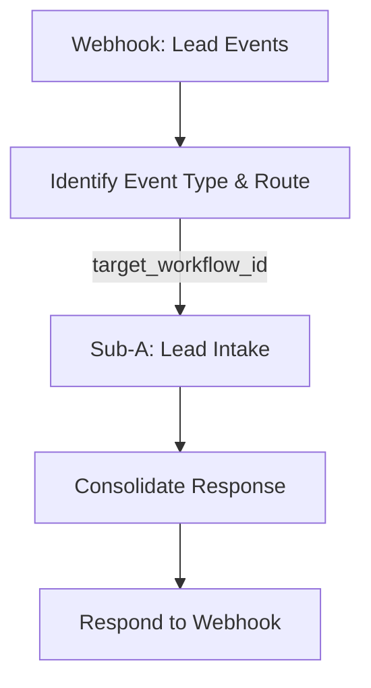

# Walkthrough: n8n Hub & Spoke Implementation

This document details the successful implementation of the "Hub & Spoke" architecture for the Lead Lifecycle Management system.

## 1. Architecture Overview

We have deployed the core **Orchestrator (Hub)** and the first **Spoke (Sub-A)**. The systems are connected via the `Execute Workflow` node, allowing modular expansion.

**System Map:**


## 2. Components Deployed

### Orchestrator (Hub)
- **Name:** `WORKFLOW A: Lead Lifecycle Manager (Orquestador)`
- **ID:** `7yRMJecj0TaIdinU`
- **Output:** `04-workflows/MEGA_WORKFLOW_1_LEAD_LIFECYCLE/01-orchestrator/artifacts/workflow_v1.json`
- **Status:** **Active** (Production URL Live)
- **URL:** `https://carrilloabgd.app.n8n.cloud/webhook/lead-events`

**Logic Flow:**
1.  **Webhook:** Receives POST properties (`event_type`, payload).
2.  **Identify (Code):** Normalizes input and determines routing strategy.
    *   *Note:* Currently handles routing logic directly to bypass activation issues with the Switch node.
3.  **Sub-A Call:** Dynamically executes the target workflow (or specifically Sub-A for 'new_lead').
4.  **Response:** Returns a standardized JSON `{ success: true, result: ... }`.

### Spoke (Sub-A)
- **Name:** `SUB-A: Lead Intake & Enrichment (v2 - Hub & Spoke)`
- **ID:** `RHj1TAqBazxNFriJ`
- **Output:** `04-workflows/MEGA_WORKFLOW_1_LEAD_LIFECYCLE/02-spokes/sub-a-lead-intake/artifacts/workflow_v2.json`
- **Status:** Skeleton Implementation (v2)
- **Role:** Receives raw lead data, processes it (mocked), and returns standardized success object.

## 3. Verification Results

We verified the system using an end-to-end integration test.

### Test Case 1: New Lead
**Payload:**
```json
{
  "event_type": "new_lead",
  "email": "juan.restore@example.com",
  "nombre": "Juan Restore",
  "empresa": "Restore Corp"
}
```

**Result:**
- **Status:** `200 OK`
- **Response:**
```json
{
  "success": true,
  "result": {
    "success": true,
    "lead_id": null,
    "score": null,
    "categoria": null,
    "message": "Lead procesado exitosamente por SUB-A"
  }
}
```
