# Gestión de Versiones Estables - Carrillo Abogados

**Última actualización**: 14 de Enero, 2026  
**Fase Proyecto**: FASE 10 - Autenticación Frontend Completa

## 📋 Resumen de Versiones Actuales

| Componente | Versión | Estado | Notas |
|------------|---------|--------|-------|
| **Spring Boot** | 3.3.13 | ✅ LTS Estable | Última versión de la línea 3.3.x LTS |
| **Spring Cloud** | 2023.0.6 | ✅ Estable | Release train compatible con Boot 3.3.x |
| **Spring Framework** | 6.1.21 | ✅ Auto-gestionado | Gestionado por Spring Boot BOM |
| **Spring Security** | 6.3.x | ✅ Auto-gestionado | Gestionado por Spring Boot BOM |
| **Java** | 21 LTS | ✅ LTS | OpenJDK Temurin |
| **springdoc-openapi** | 2.6.0 | ✅ Compatible | Compatible con Spring Boot 3.3.x |
| **Testcontainers** | 1.20.4 | ✅ Estable | Para tests de integración |

## 🔧 Matriz de Compatibilidad

```
Spring Boot 3.3.x → Spring Cloud 2023.0.x
Spring Boot 3.4.x → Spring Cloud 2024.0.x
Spring Boot 3.5.x → Spring Cloud 2025.0.x (cuando esté disponible)
```

### Regla de Compatibilidad springdoc-openapi

| Spring Boot | springdoc-openapi |
|-------------|-------------------|
| 3.3.x | 2.5.x - 2.6.x |
| 3.4.x | 2.7.x |
| 3.5.x | 2.7.x+ |

## 📦 Extensiones VS Code Instaladas

Para gestión de versiones y desarrollo:

1. **Version Lens** (`pflannery.vscode-versionlens`)
   - Muestra versiones disponibles directamente en el POM
   - Detecta actualizaciones de dependencias

2. **Spring Boot Extension Pack** (`vmware.vscode-boot-dev-pack`)
   - Soporte completo para desarrollo Spring Boot
   - Dashboard de aplicaciones, actuator, etc.

3. **Project Manager for Java** (`vscjava.vscode-java-dependency`)
   - Gestión de dependencias Maven/Gradle
   - Vista de árbol de dependencias

4. **XML** (`redhat.vscode-xml`)
   - Validación de POM.xml
   - Autocompletado y formateo

## 🚀 Comandos de Verificación

### Compilar el proyecto
```bash
./mvnw clean compile -DskipTests
```

### Ejecutar todos los tests
```bash
./mvnw clean test
```

### Verificar versiones de dependencias
```bash
./mvnw dependency:tree
```

### Buscar actualizaciones de dependencias
```bash
./mvnw versions:display-dependency-updates
```

### Buscar actualizaciones de plugins
```bash
./mvnw versions:display-plugin-updates
```

## 📁 Archivos de Configuración

| Archivo | Propósito |
|---------|-----------|
| `pom.xml` (raíz) | POM padre con versiones centralizadas |
| `infrastructure/versions.yaml` | Documentación de versiones |
| `docs/VERSION_STABILITY.md` | Este documento |

## ⚠️ Consideraciones Importantes

### Al actualizar Spring Boot:

1. **Verificar compatibilidad** con Spring Cloud
2. **Actualizar springdoc-openapi** según la matriz
3. **Ejecutar tests completos** (`./mvnw clean test`)
4. **Probar en entorno local** antes de desplegar

### Al actualizar dependencias:

1. **No usar versiones snapshot** en producción
2. **Preferir versiones LTS** cuando estén disponibles
3. **Verificar CVEs** antes de actualizar
4. **Documentar cambios** en CHANGELOG

## 🔄 Ciclo de Actualización Recomendado

```mermaid
graph LR
    A[Detectar actualización] --> B[Verificar compatibilidad]
    B --> C[Actualizar en rama dev]
    C --> D[Ejecutar tests]
    D --> E{Tests pasan?}
    E -->|Sí| F[Merge a staging]
    E -->|No| G[Investigar problemas]
    G --> C
    F --> H[Validar en staging]
    H --> I[Merge a main]
```



## 📊 Estado del Build

✅ **BUILD SUCCESS** - 17/12/2024

```
Reactor Summary:
- carrillo-legal-tech ............ SUCCESS
- api-gateway .................... SUCCESS
- user-service ................... SUCCESS
- client-service ................. SUCCESS
- case-service ................... SUCCESS
- payment-service ................ SUCCESS
- document-service ............... SUCCESS
- calendar-service ............... SUCCESS
- notification-service ........... SUCCESS
- n8n-integration-service ........ SUCCESS
```

---

*Documento mantenido por el equipo de desarrollo de Carrillo Abogados*
